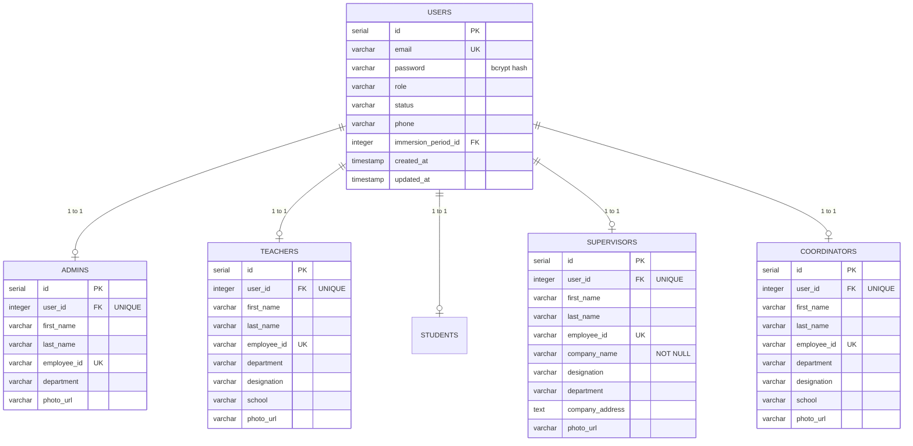
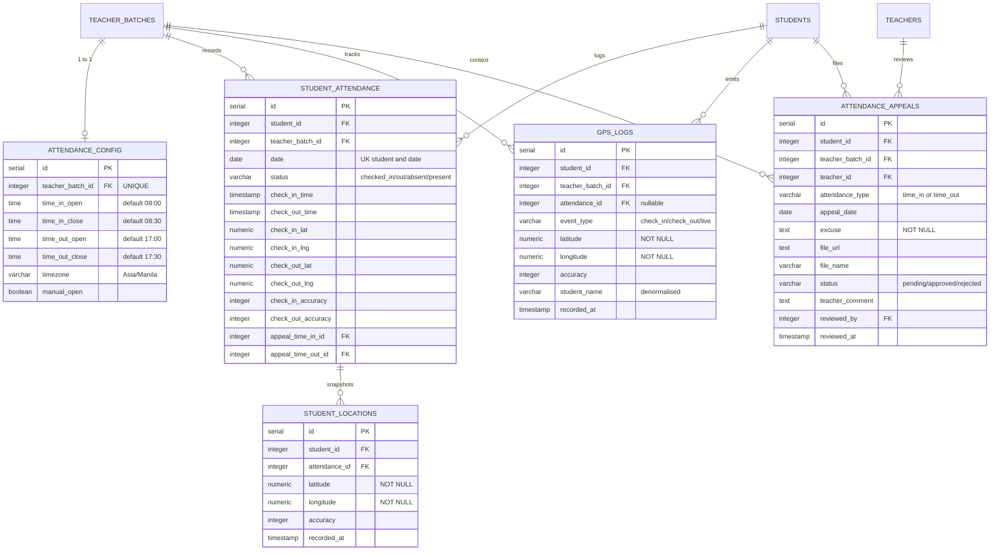
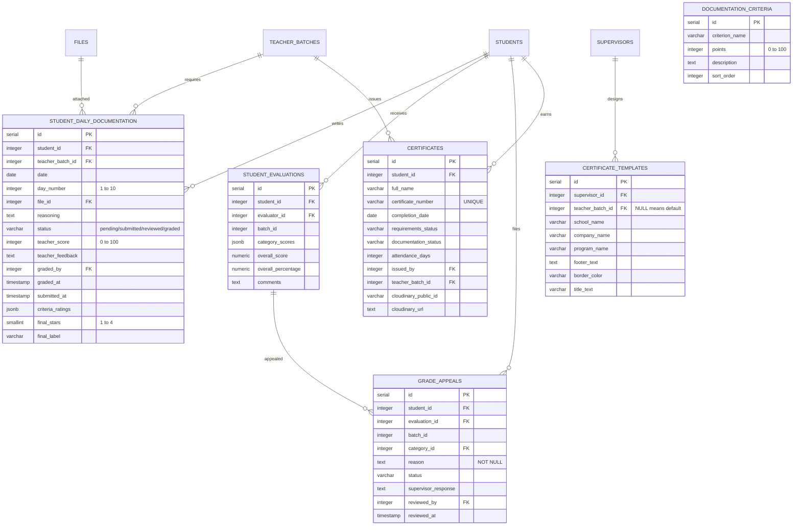
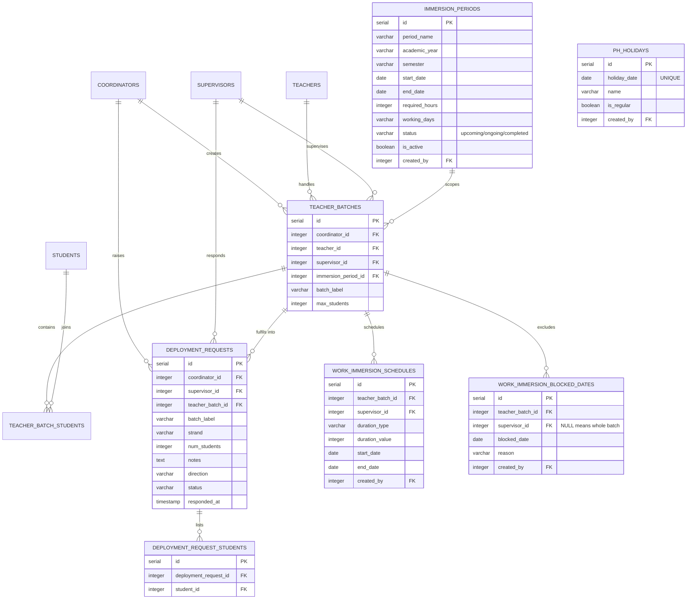
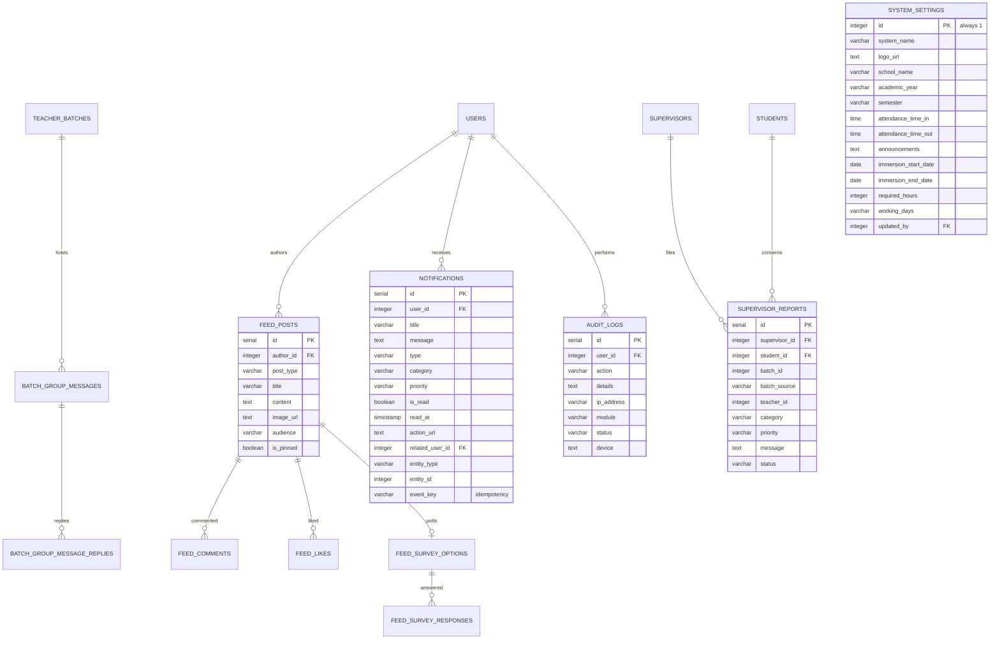
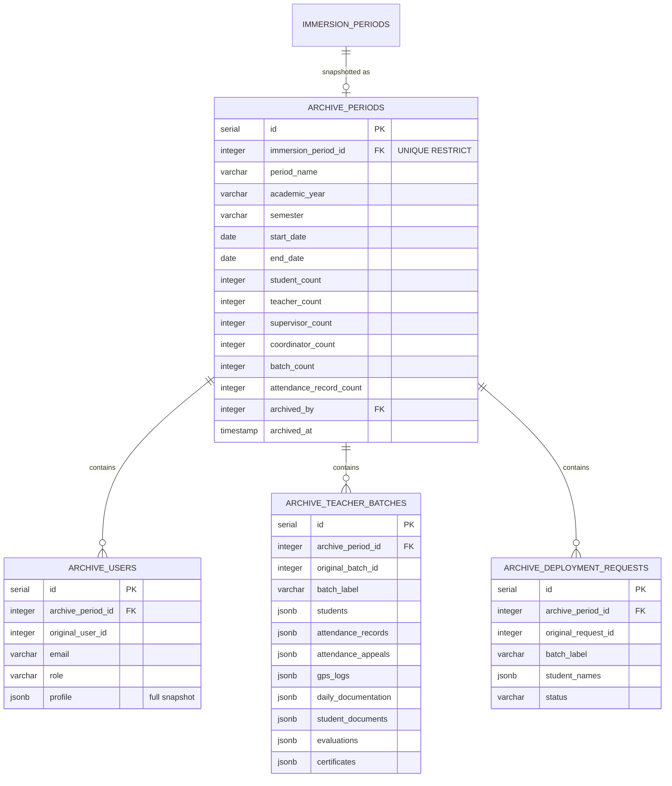

# Database Schema - Work Immersion Monitoring System (WIMS)

> **Capstone Project Documentation**
> Repository: `Long-Live-The-Emperor`
> Scope: Complete logical and physical design of the production PostgreSQL database,
> reverse-engineered from the application source code in `server/`.

---

## Table of Contents

1. [System Overview](#1-system-overview)
2. [Technology Stack](#2-technology-stack)
3. [Design Principles](#3-design-principles)
4. [Schema Statistics](#4-schema-statistics)
5. [Entity-Relationship Diagrams](#5-entity-relationship-diagrams)
6. [Data Dictionary](#6-data-dictionary)
7. [Foreign Key Relationship Map](#7-foreign-key-relationship-map)
8. [Index Catalogue](#8-index-catalogue)
9. [Constraints, Triggers and Functions](#9-constraints-triggers-and-functions)
10. [Enumerated Values and Status Lifecycles](#10-enumerated-values-and-status-lifecycles)
11. [Date and Timezone Policy](#11-date-and-timezone-policy)
12. [Data Retention and Archiving](#12-data-retention-and-archiving)
13. [Migration History](#13-migration-history)
14. [Schema Provenance and Known Inconsistencies](#14-schema-provenance-and-known-inconsistencies)
15. [Security and Deployment](#15-security-and-deployment)

---

## 1. System Overview

**Work Immersion Monitoring System (WIMS)** is a multi-role web application that manages
the Philippine Senior High School (SHS) **Work Immersion / Immersion Program** - the
mandatory industry internship embedded in the Grade 12 curriculum.

The system connects four operational roles plus a system administrator, and tracks a
student's entire immersion lifecycle from account creation to certificate issuance.

### 1.1 The Five Roles

| Role | Code | Responsibility |
|------|------|----------------|
| **Administrator** | `admin` | System-wide configuration, user approval, audit trail, academic period and archive management. |
| **Coordinator** | `coordinator` | School-side case officer. Approves accounts, forms teacher batches, assigns students, reviews requirement documents, certifies completion. |
| **Teacher** | `teacher` | Faculty monitor. Tracks daily attendance, sets attendance windows, reviews and grades daily documentation, issues evaluations. |
| **Student** | `student` | Subject of the program. Checks in and out with GPS, uploads daily documentation, submits requirements, appeals grades. |
| **Supervisor** | `supervisor` | Company-side host. Requests student deployment, manages the immersion schedule, issues narrative reports, releases certificates. |

### 1.2 Functional Modules Mapped to Tables

| # | Module | API Base | Tables |
|---|--------|----------|--------|
| 1 | Authentication and Accounts | `/api/users`, `/api/admin` | `users`, `admins`, `teachers`, `students`, `supervisors`, `coordinators`, `password_reset_tokens`, `login_attempts` |
| 2 | Academic Periods | `/api/admin` | `immersion_periods`, `users.immersion_period_id` |
| 3 | Batch Management | `/api/coordinator` | `teacher_batches`, `teacher_batch_students` |
| 4 | Student Deployment | `/api/coordinator`, `/api/supervisor` | `deployment_requests`, `deployment_request_students` |
| 5 | Attendance Tracking | `/api/attendance` | `attendance_config`, `student_attendance`, `student_locations`, `gps_logs` |
| 6 | Attendance Appeals | `/api/attendance`, `/api/supervisor` | `attendance_appeals` |
| 7 | Immersion Scheduling | `/api/teacher`, `/api/supervisor` | `work_immersion_schedules`, `work_immersion_blocked_dates`, `ph_holidays` |
| 8 | Requirements and Documents | `/api/coordinator`, `/api/files` | `document_types`, `student_requirement_submissions`, `student_documents`, `submission_logs`, `files` |
| 9 | Daily Documentation | `/api/documentation` | `student_daily_documentation`, `documentation_criteria` |
| 10 | Student Evaluation | `/api/evaluation`, `/api/appeals` | `evaluation_criteria`, `student_evaluations`, `grade_appeals`, `evaluations` |
| 11 | Certificates | `/api/certificate` | `certificates`, `certificate_templates` |
| 12 | Social Feed and Surveys | `/api/feed` | `feed_posts`, `feed_comments`, `feed_likes`, `feed_survey_options`, `feed_survey_responses` |
| 13 | Batch Group Chat | `/api/chat` | `batch_group_messages`, `batch_group_message_replies` |
| 14 | Notifications | `/api/notifications` | `notifications` |
| 15 | Supervisor Reports | `/api/supervisor` | `supervisor_reports` |
| 16 | System Administration | `/api/admin` | `system_settings`, `audit_logs` |
| 17 | Period Archival | `/api/admin` | `archive_periods`, `archive_users`, `archive_teacher_batches`, `archive_deployment_requests` |

---
## 2. Technology Stack

| Layer | Technology | Version | Evidence |
|-------|-----------|---------|----------|
| Database Engine | **PostgreSQL** | 12+ | `server/db/index.js` |
| Connection Driver | `pg` (node-postgres) | ^8.22.0 | `server/package.json` |
| Query Helper | `pg-promise` | ^12.7.0 | `server/package.json` |
| ORM | **None** - raw parameterized SQL | - | All controllers issue `$1`-`$n` queries |
| Extensions | `citext` (case-insensitive text) | - | `server/db/schema.sql` |
| Migration Style | Numbered `.sql` files plus idempotent runtime `ensure*Schema()` | - | `server/db/migrations/` |
| Data Types Used | `SERIAL`, `VARCHAR`, `TEXT`, `NUMERIC`, `JSONB`, `INTEGER[]`, `TIMESTAMP`, `DATE`, `TIME`, `BOOLEAN` | - | Across all DDL |
| File Storage | Cloudinary (external CDN) | ^1.41.3 | `server/db/cloudinary.js` |
| Realtime | Socket.IO | ^4.8.3 | `server/sockets/index.js` |
| PDF Generation | PDFKit | ^0.19.1 | `certificate.controller.js` |
| Spreadsheet I/O | `xlsx` | ^0.18.5 | `server/utils/excelUpload.js` |

**Database name:** `work_immersion_db` (via the `DB_NAME` environment variable).

### 2.1 Connection Configuration

```js
// server/db/index.js
const pool = new Pool({
  user:     process.env.DB_USER,
  password: process.env.DB_PASSWORD,
  host:     process.env.DB_HOST,
  port:     process.env.DB_PORT,
  database: process.env.DB_NAME,
});

// Custom DATE parser - returns the raw 'YYYY-MM-DD' string instead of a JS Date,
// preventing UTC-midnight drift (see Section 11).
types.setTypeParser(1082, (val) => (val === null ? val : String(val)));
```

### 2.2 Required Environment Variables

| Variable | Purpose | Example |
|----------|---------|---------|
| `DB_USER` | PostgreSQL role | `postgres` |
| `DB_PASSWORD` | PostgreSQL password | (redacted) |
| `DB_HOST` | Server host | `localhost` |
| `DB_PORT` | Server port | `5432` |
| `DB_NAME` | Database name | `work_immersion_db` |
| `PORT` | Express server port | `5000` |
| `JWT_SECRET` | JWT signing key | (redacted) |
| `CLOUDINARY_*` | Cloudinary credentials | - |

---

## 3. Design Principles

### 3.1 Role Inheritance via Table-Per-Role (Class Table Inheritance)

The central design decision of this schema. Rather than one wide `users` table with dozens of
nullable role-specific columns, the system uses **Class Table Inheritance (CTI)**:

```
users (1) --1:1--> admins         (role = 'admin')
       |
       +--1:1--> teachers        (role = 'teacher')
       +--1:1--> students        (role = 'student')
       +--1:1--> supervisors     (role = 'supervisor')
       +--1:1--> coordinators    (role = 'coordinator')
```

- `users` holds **only** fields common to every role: `email`, `password`, `role`, `status`,
  `phone`, timestamps, and `immersion_period_id`.
- Each role profile table holds the fields **unique to that role**, keyed by
  `user_id INTEGER NOT NULL UNIQUE REFERENCES users(id) ON DELETE CASCADE`.
- The `UNIQUE` constraint on `user_id` makes the 1:1 relationship structurally enforced at the
  database level - a user can have **at most one** profile row.
- The `CHECK (role IN (...))` constraint on `users.role` makes `users` the single
  authoritative source of role truth.

**Why this design:**

- Eliminates the "wide sparse table" anti-pattern (no `supervisor_company_name` column sitting
  NULL on every student account).
- Each role table can grow independently without touching the others.
- `ON DELETE CASCADE` guarantees deleting a user leaves no orphan profile data.
- Queries for role-specific data stay short and index-friendly.

> **Enforcement caveat:** CTI integrity is *not* fully enforced - nothing stops a row being
> inserted into `teachers` for a `users` row whose role is `'student'`. This is validated in
> the service layer (controllers) instead. See Section 14.

### 3.2 Dual-Key Strategy (Critical Implementation Detail)

The system uses **two different key spaces** for people. Mixing them is the single most common
source of bugs in this codebase, so it is documented explicitly.

| Key | Where it lives | Meaning |
|-----|----------------|---------|
| **`users.id`** | `users` | The **login account** identity. This is what the JWT carries (`req.user.id`). |
| **`<role>.id`** | `students`, `teachers`, `supervisors`, `coordinators` | The **profile** identity. This is what foreign keys reference. |

**Both are named `id`, but they are different numbers.** Correct usage from the live codebase:

```sql
-- Correct: the JWT gives users.id, look up the profile id
SELECT id, first_name, last_name, student_number
  FROM students WHERE user_id = $1;            -- returns students.id (profile key)

-- Correct: foreign keys always reference the profile table
INSERT INTO student_attendance (student_id, teacher_batch_id, date, status)
VALUES ($1, $2, $3, $4);                       -- $1 = students.id, NOT users.id
```

`deploymentRequest.controller.js` -> `getCoordinatorProfileId()` documents this explicitly:

> *"Resolves the caller's `coordinators.id` (`teacher_batches` stores that, not the
> `users.id` that the JWT carries)."*
### 3.3 Inconsistent Key Target (Documented Defect)

Not every foreign key follows the dual-key rule. `teacher_batches.supervisor_id` **references
`users(id)`** (per `migrations/003`), while `teacher_batches.teacher_id` and `.coordinator_id`
**reference the profile tables**. This is preserved faithfully in this document and flagged in
Section 14.

| Column | Declared FK target | Consistent? |
|--------|-------------------|-------------|
| `teacher_batches.teacher_id` | `teachers(id)` | Yes |
| `teacher_batches.coordinator_id` | `coordinators(id)` | Yes |
| `teacher_batches.supervisor_id` | `users(id)` | No - uses the login key |

Most code compensates correctly (`teacherBatch.controller.js` line 406:
`LEFT JOIN supervisors sv ON sv.user_id = tb.supervisor_id`), but
`periodArchive.service.js` line 77 joins `supervisors sup ON sup.id = tb.supervisor_id` -
which is the wrong join for a `users(id)` column.

### 3.4 Idempotent, Self-Healing Schema

The project has **no migration runner**. `server/package.json` defines only `start` and `dev`.
Schema evolution is therefore handled by two complementary mechanisms:

1. **Numbered SQL migration files** in `server/db/migrations/` - applied manually via `psql -f`.
   Documented in Section 13.
2. **Runtime `ensure*Tables()` / `ensure*Schema()` guards** in controllers, services and utils.
   Every one is built from `CREATE TABLE IF NOT EXISTS`,
   `ALTER TABLE ... ADD COLUMN IF NOT EXISTS` and `CREATE INDEX IF NOT EXISTS`, so calling them
   repeatedly is a no-op.

The effect is that **the schema self-heals on first use** of any module - a new feature works
even if its migration was never applied. This is a deliberate, defensive architectural choice
and a genuine strength for a multi-developer capstone project.

### 3.5 JSONB for Semi-Structured and Snapshot Data

`JSONB` is used in two distinct ways.

**(a) Computed / derived data (queryable):**

| Column | Shape | Purpose |
|--------|-------|---------|
| `student_evaluations.category_scores` | `{"1": 4.5, "2": 3.2}` | Score keyed by `evaluation_criteria.id` |
| `student_daily_documentation.criteria_ratings` | `{"1": 5, "3": 4}` | 1-5 stars per documentation criterion |
| `evaluation_criteria.indicators` | `["Works cooperatively", ...]` | Behavioural indicator list |
| `batch_group_messages.reactions` | `{"thumbsup": 3}` | Emoji reaction map |
| `notifications.entity_type` + `entity_id` | `'attendance_appeal'`, `12` | Polymorphic pointer to the related record |
| `notifications.event_key` | `'appeal:12:approved'` | Idempotency key preventing duplicate alerts |

**(b) Archive snapshots (denormalised, self-contained, read-only):**

The four `archive_*` tables store **fully self-contained JSONB snapshots** of an entire
immersion period. Each row keeps the `original_*_id` so the snapshot remains inspectable
independently of the live database - which is precisely the point of archiving.

### 3.6 Referential Actions Policy

| Action | When used | Rationale |
|--------|-----------|-----------|
| `ON DELETE CASCADE` | Child rows meaningless without the parent (attendance, documents, messages) | Deleting a student or batch removes dependents automatically. Prevents orphans. |
| `ON DELETE SET NULL` | Optional/attribution links (`issued_by`, `reviewed_by`, `archived_by`, `created_by`) | Preserve the **historical fact** after the person is deleted. An audit record must never vanish because its author was removed. |
| `ON DELETE RESTRICT` | `archive_periods.immersion_period_id` | An archived period must never be silently deleted. |

This is a well-considered policy: **cascade for data, preserve for provenance.**

### 3.7 Soft Deletion

Instead of hard-deleting rows that carry historical value, the system uses soft-delete mechanisms:

- `document_types.is_active` - requirements stay for history but are hidden from checklists
- `batch_group_messages.is_deleted` + `deleted_by_user_ids INTEGER[]` - **per-user deletion**;
  each user sees the message as deleted for *themselves* only, while others still see it
- `users.status` - the `pending` to `approved`/`rejected`/`archived` account lifecycle
- `feed_posts.is_pinned` - priority ordering rather than deletion
### 3.8 Enforced Invariants (CHECK Constraints)

| Constraint | Table | Rule |
|------------|-------|------|
| `users_role_check` | `users` | `role IN ('admin','teacher','student','supervisor','coordinator')` |
| `student_attendance_status_check` | `student_attendance` | `status IN ('checked_in','checked_out','absent','present')` |
| `gps_logs_event_type_check` | `gps_logs` | `event_type IN ('check_in','check_out','live')` |
| `attendance_appeals.attendance_type_check` | `attendance_appeals` | `attendance_type IN ('time_in','time_out')` |
| `attendance_appeals.status_check` | `attendance_appeals` | `status IN ('pending','approved','rejected')` |
| `feed_posts.audience_check` | `feed_posts` | `audience IN ('all','student','teacher','supervisor','coordinator')` |
| `evaluations_rating_check` | `evaluations` | `rating BETWEEN 1 AND 10` |
| day-number range | `student_daily_documentation` | `day_number BETWEEN 1 AND 10` |
| teacher-score range | `student_daily_documentation` | `teacher_score BETWEEN 0 AND 100` |
| star range | `student_daily_documentation` | `final_stars BETWEEN 1 AND 4` |
| points range | `documentation_criteria` | `points BETWEEN 0 AND 100` |
| duration-type check | `work_immersion_schedules` | `duration_type IN ('hours','days')` |
| period-status check | `immersion_periods` | `status IN ('upcoming','ongoing','completed')` |
| `one_settings_row` | `system_settings` | `id = 1` - singleton table |

### 3.9 Composite Uniqueness (Idempotent Business Rules)

| Constraint | Table | Enforces |
|------------|-------|----------|
| `UNIQUE(student_id, date)` | `student_attendance` | One attendance record per student per calendar day. |
| `UNIQUE(teacher_batch_id, student_id)` | `teacher_batch_students` | A student cannot be added to the same batch twice. |
| `UNIQUE(student_id)` | `student_requirement_submissions` | Exactly one requirement set per student. |
| `UNIQUE(student_id, teacher_batch_id, date)` | `student_daily_documentation` | One entry per student per batch per day. |
| `UNIQUE(teacher_batch_id)` | `attendance_config` | Exactly one attendance window config per batch. |
| `UNIQUE(post_id, user_id)` | `feed_likes` | A user can like a post only once. |
| `UNIQUE(post_id, user_id)` | `feed_survey_responses` | A user can answer a survey post only once. |
| `UNIQUE(teacher_batch_id, supervisor_id)` | `work_immersion_schedules` | One schedule per batch+supervisor pair. |
| `UNIQUE(immersion_period_id)` | `archive_periods` | A period can be archived only once. |
| `UNIQUE(code)` | `document_types` | Document type codes are stable identifiers. |
| `UNIQUE(certificate_number)` | `certificates` | Certificate numbers are globally unique. |
| `UNIQUE(token)` | `password_reset_tokens` | Reset tokens never repeat. |
| `UNIQUE(user_id)` | all five role tables | Enforces the 1:1 CTI relationship. |

> **NULL semantics note:** PostgreSQL treats NULLs as *distinct* in unique indexes. The codebase
> handles this deliberately (see `migrations/023` and `migrations/024`) by using **partial unique
> indexes** with a `WHERE ... IS NOT NULL` predicate instead of table-level `UNIQUE` constraints.

---

## 4. Schema Statistics

| Metric | Count |
|--------|-------|
| **Total tables** | **49** |
| Core identity tables | 6 |
| Security tables | 2 |
| Period tables | 1 |
| Batch and deployment tables | 4 |
| Scheduling and calendar tables | 3 |
| Attendance and tracking tables | 5 |
| Document and requirement tables | 5 |
| Evaluation and appeal tables | 4 |
| Certificate tables | 2 |
| Communication tables | 8 |
| Reporting and system tables | 3 |
| Archive (snapshot) tables | 4 |
| Explicit indexes | 45+ |
| CHECK constraints | 14 |
| Triggers | 1 |
| Stored functions | 3 |
| Seed data sets | 6 |

### 4.1 Table Inventory (alphabetical)

| # | Table | Module | Expected Volume |
|---|-------|--------|-----------------|
| 1 | `admins` | Identity | Few (1-3) |
| 2 | `archive_deployment_requests` | Archive | Historical |
| 3 | `archive_periods` | Archive | Few |
| 4 | `archive_teacher_batches` | Archive | Historical |
| 5 | `archive_users` | Archive | Historical |
| 6 | `attendance_appeals` | Attendance | Moderate |
| 7 | `attendance_config` | Attendance | 1 per batch |
| 8 | `audit_logs` | System | **Very high** (grows unbounded) |
| 9 | `batch_group_message_replies` | Communication | Moderate |
| 10 | `batch_group_messages` | Communication | Moderate |
| 11 | `certificate_templates` | Certificates | 1 per supervisor/batch |
| 12 | `certificates` | Certificates | 1 per student |
| 13 | `coordinators` | Identity | Few (1-5) |
| 14 | `deployment_request_students` | Deployment | Moderate |
| 15 | `deployment_requests` | Deployment | Moderate |
| 16 | `document_types` | Requirements | 10 (seeded) |
| 17 | `documentation_criteria` | Documentation | 8 (seeded) |
| 18 | `evaluation_criteria` | Evaluation | 9 (seeded) |
| 19 | `evaluations` | Evaluation (legacy) | Low |
| 20 | `feed_comments` | Communication | Moderate |
| 21 | `feed_likes` | Communication | **High** |
| 22 | `feed_posts` | Communication | Moderate |
| 23 | `feed_survey_options` | Communication | Low |
| 24 | `feed_survey_responses` | Communication | Moderate |
| 25 | `files` | Documents | **High** (binary metadata) |
| 26 | `gps_logs` | Tracking | **Very high** (live pings) |
| 27 | `grade_appeals` | Evaluation | Low |
| 28 | `immersion_periods` | Periods | Few |
| 29 | `login_attempts` | Security | **High** (security telemetry) |
| 30 | `notifications` | Communication | **High** |
| 31 | `password_reset_tokens` | Security | Low (ephemeral) |
| 32 | `ph_holidays` | Calendar | ~30-60 |
| 33 | `student_attendance` | Attendance | **Very high** (students x days) |
| 34 | `student_daily_documentation` | Documentation | **Very high** (students x days) |
| 35 | `student_documents` | Requirements | 1 per student per doc type |
| 36 | `student_evaluations` | Evaluation | Few per student |
| 37 | `student_locations` | Tracking | **Very high** (live pings) |
| 38 | `student_requirement_submissions` | Requirements | 1 per student |
| 39 | `students` | Identity | **High** (all students) |
| 40 | `submission_logs` | Requirements | Moderate |
| 41 | `supervisor_reports` | Reporting | Low to moderate |
| 42 | `supervisors` | Identity | Moderate |
| 43 | `system_settings` | System | **Exactly 1** (singleton) |
| 44 | `teacher_batch_students` | Batches | **High** (M:N junction) |
| 45 | `teacher_batches` | Batches | Moderate |
| 46 | `teachers` | Identity | Moderate |
| 47 | `users` | Identity | **High** (all accounts) |
| 48 | `work_immersion_blocked_dates` | Scheduling | Low |
| 49 | `work_immersion_schedules` | Scheduling | 1 per batch+supervisor |

> Tables marked **Very high** / **High** are the growth drivers and the primary targets for
> retention policy, partitioning, and index review.

---
## 5. Entity-Relationship Diagrams

### 5.1 High-Level System ER Diagram

```mermaid
erDiagram
    USERS ||--o| ADMINS : "has profile"
    USERS ||--o| TEACHERS : "has profile"
    USERS ||--o| STUDENTS : "has profile"
    USERS ||--o| SUPERVISORS : "has profile"
    USERS ||--o| COORDINATORS : "has profile"
    USERS ||--o{ PASSWORD_RESET_TOKENS : "requests"
    USERS ||--o{ NOTIFICATIONS : "receives"
    USERS ||--o{ AUDIT_LOGS : "performs"
    USERS }o--o| IMMERSION_PERIODS : "belongs to"

    TEACHERS ||--o{ TEACHER_BATCHES : "handles"
    COORDINATORS ||--o{ TEACHER_BATCHES : "creates"
    SUPERVISORS ||--o{ TEACHER_BATCHES : "supervises"
    IMMERSION_PERIODS ||--o{ TEACHER_BATCHES : "scopes"
    TEACHER_BATCHES ||--o{ TEACHER_BATCH_STUDENTS : "contains"
    STUDENTS ||--o{ TEACHER_BATCH_STUDENTS : "joins"

    TEACHER_BATCHES ||--o| ATTENDANCE_CONFIG : "configures"
    TEACHER_BATCHES ||--o{ STUDENT_ATTENDANCE : "records"
    STUDENTS ||--o{ STUDENT_ATTENDANCE : "logs"
    STUDENT_ATTENDANCE ||--o{ STUDENT_LOCATIONS : "positions"
    TEACHER_BATCHES ||--o{ GPS_LOGS : "tracks"
    STUDENTS ||--o{ GPS_LOGS : "emits"
    TEACHER_BATCHES ||--o{ ATTENDANCE_APPEALS : "receives"
    STUDENTS ||--o{ ATTENDANCE_APPEALS : "files"

    TEACHER_BATCHES ||--o{ WORK_IMMERSION_SCHEDULES : "schedules"
    TEACHER_BATCHES ||--o{ WORK_IMMERSION_BLOCKED_DATES : "excludes"

    STUDENTS ||--o| STUDENT_REQUIREMENT_SUBMISSIONS : "submits"
    STUDENT_REQUIREMENT_SUBMISSIONS ||--o{ STUDENT_DOCUMENTS : "contains"
    DOCUMENT_TYPES ||--o{ STUDENT_DOCUMENTS : "classifies"
    STUDENT_REQUIREMENT_SUBMISSIONS ||--o{ SUBMISSION_LOGS : "audits"
    STUDENTS ||--o{ FILES : "uploads"
    FILES ||--o{ STUDENT_DAILY_DOCUMENTATION : "attaches"

    TEACHER_BATCHES ||--o{ STUDENT_DAILY_DOCUMENTATION : "requires"
    STUDENTS ||--o{ STUDENT_DAILY_DOCUMENTATION : "writes"
    STUDENTS ||--o{ STUDENT_EVALUATIONS : "receives"
    STUDENT_EVALUATIONS ||--o{ GRADE_APPEALS : "appeals"
    EVALUATION_CRITERIA ||--o{ GRADE_APPEALS : "targets"

    STUDENTS ||--o{ CERTIFICATES : "earns"
    SUPERVISORS ||--o{ CERTIFICATE_TEMPLATES : "designs"
    TEACHER_BATCHES ||--o{ CERTIFICATES : "issues"

    COORDINATORS ||--o{ DEPLOYMENT_REQUESTS : "raises"
    SUPERVISORS ||--o{ DEPLOYMENT_REQUESTS : "responds"
    DEPLOYMENT_REQUESTS ||--o{ DEPLOYMENT_REQUEST_STUDENTS : "lists"

    TEACHER_BATCHES ||--o{ BATCH_GROUP_MESSAGES : "hosts"
    BATCH_GROUP_MESSAGES ||--o{ BATCH_GROUP_MESSAGE_REPLIES : "replies"
    USERS ||--o{ FEED_POSTS : "authors"
    FEED_POSTS ||--o{ FEED_COMMENTS : "commented"
    FEED_POSTS ||--o{ FEED_LIKES : "liked"
    FEED_POSTS ||--o| FEED_SURVEY_OPTIONS : "polls"
    FEED_SURVEY_OPTIONS ||--o| FEED_SURVEY_RESPONSES : "answered"

    SUPERVISORS ||--o{ SUPERVISOR_REPORTS : "files"
    STUDENTS ||--o{ SUPERVISOR_REPORTS : "concerns"

    IMMERSION_PERIODS ||--o| ARCHIVE_PERIODS : "archived into"
    ARCHIVE_PERIODS ||--o{ ARCHIVE_USERS : "snapshots"
    ARCHIVE_PERIODS ||--o{ ARCHIVE_TEACHER_BATCHES : "snapshots"
    ARCHIVE_PERIODS ||--o{ ARCHIVE_DEPLOYMENT_REQUESTS : "snapshots"

    USERS {
        serial id PK
        varchar email UK
        varchar password
        varchar role "CHECK 5 roles"
        varchar status "pending or approved"
        varchar phone
        integer immersion_period_id FK
        timestamp created_at
        timestamp updated_at
    }
    STUDENTS {
        serial id PK
        integer user_id FK "UNIQUE 1 to 1"
        varchar student_number UK
        varchar first_name
        varchar middle_name
        varchar last_name
        varchar suffix
        varchar gender
        date birthdate
        integer age
        varchar contact_number
        varchar grade_level "default 12"
        varchar section
        varchar track_strand
        varchar school
        text career_goal
        text industry_reason
        varchar guardian_name
        varchar guardian_contact
        varchar photo_url
    }
    TEACHER_BATCHES {
        serial id PK
        integer coordinator_id FK
        integer teacher_id FK
        integer supervisor_id FK
        integer immersion_period_id FK
        varchar batch_label
        integer max_students "default 30"
    }
```



### 5.2 Identity and Role Inheritance


### 5.3 Attendance and GPS Tracking



### 5.4 Documentation, Evaluation and Certification Pipeline


### 5.5 Batch, Deployment and Scheduling



### 5.6 Communication, Reporting and System



### 5.7 Archival Subsystem



---
## 6. Data Dictionary

Column legend - **PK** Primary Key | **FK** Foreign Key | **UK** Unique

### 6.1 Identity and Access Control

#### `users` - Central account table (all roles)

| Column | Type | Null | Key | Default | Description |
|--------|------|------|-----|---------|-------------|
| `id` | SERIAL | No | PK | auto | Login account identity. Referenced by the JWT. |
| `email` | VARCHAR(255) | No | UK | - | Login email. `citext` gives case-insensitive matching. |
| `password` | VARCHAR(255) | No | | - | bcrypt hash (cost 12). Never returned by any API. |
| `role` | VARCHAR(50) | No | | - | `admin`, `teacher`, `student`, `supervisor`, `coordinator` (CHECK). |
| `status` | VARCHAR(50) | No | | `'pending'` | Lifecycle: `pending`, `approved`, `rejected`, `archived`. |
| `phone` | VARCHAR(50) | Yes | | - | Contact number. Normalised to `''` for students (migration 018). |
| `immersion_period_id` | INTEGER | Yes | FK | - | -> `immersion_periods(id)` `ON DELETE SET NULL`. Scopes archival. |
| `created_at` | TIMESTAMP | Yes | | `CURRENT_TIMESTAMP` | Row creation time. |
| `updated_at` | TIMESTAMP | Yes | | `CURRENT_TIMESTAMP` | Last modification time. |

**Indexes:** `idx_users_role_status (role, status)`, `idx_users_email (email)`,
`idx_users_period (immersion_period_id)`

#### `admins` - Administrator profile

| Column | Type | Null | Key | Default | Description |
|--------|------|------|-----|---------|-------------|
| `id` | SERIAL | No | PK | auto | Profile key. |
| `user_id` | INTEGER | No | FK, UK | - | -> `users(id)` `ON DELETE CASCADE`. Enforces 1:1. |
| `first_name` | VARCHAR(100) | No | | - | Given name. |
| `last_name` | VARCHAR(100) | No | | - | Family name. |
| `employee_id` | VARCHAR(100) | Yes | UK | - | Institutional employee number. |
| `department` | VARCHAR(255) | Yes | | - | Owning department. |
| `photo_url` | VARCHAR(512) | Yes | | - | Profile picture (Cloudinary). Added by migration 007. |

#### `teachers` - Teacher profile

| Column | Type | Null | Key | Default | Description |
|--------|------|------|-----|---------|-------------|
| `id` | SERIAL | No | PK | auto | Profile key. Referenced by `teacher_batches.teacher_id`. |
| `user_id` | INTEGER | No | FK, UK | - | -> `users(id)` `ON DELETE CASCADE`. |
| `first_name` | VARCHAR(100) | No | | - | Given name. |
| `last_name` | VARCHAR(100) | No | | - | Family name. |
| `employee_id` | VARCHAR(100) | Yes | UK | - | Institutional employee number. |
| `department` | VARCHAR(255) | Yes | | - | Department assignment. |
| `designation` | VARCHAR(255) | Yes | | - | Rank/position. |
| `school` | VARCHAR(255) | Yes | | - | Home school/college. |
| `photo_url` | VARCHAR(512) | Yes | | - | Profile picture. Added by migration 007. |

#### `supervisors` - Company-side host profile

| Column | Type | Null | Key | Default | Description |
|--------|------|------|-----|---------|-------------|
| `id` | SERIAL | No | PK | auto | Profile key. |
| `user_id` | INTEGER | No | FK, UK | - | -> `users(id)` `ON DELETE CASCADE`. |
| `first_name` | VARCHAR(100) | No | | - | Given name. |
| `last_name` | VARCHAR(100) | No | | - | Family name. |
| `employee_id` | VARCHAR(100) | Yes | UK | - | Company employee ID. Seeded as `SUP-1001`+. |
| `company_name` | VARCHAR(255) | No | | - | Host company (NOT NULL - a supervisor must belong to one). |
| `designation` | VARCHAR(255) | Yes | | - | Job title at the company. |
| `department` | VARCHAR(255) | Yes | | - | Company department. |
| `company_address` | TEXT | Yes | | - | Worksite address (used for geofencing). |
| `photo_url` | VARCHAR(512) | Yes | | - | Profile picture. Added by migration 007. |

#### `coordinators` - School-side programme officer profile

| Column | Type | Null | Key | Default | Description |
|--------|------|------|-----|---------|-------------|
| `id` | SERIAL | No | PK | auto | Profile key. Referenced by `teacher_batches.coordinator_id`. |
| `user_id` | INTEGER | No | FK, UK | - | -> `users(id)` `ON DELETE CASCADE`. |
| `first_name` | VARCHAR(100) | No | | - | Given name. |
| `last_name` | VARCHAR(100) | No | | - | Family name. |
| `employee_id` | VARCHAR(100) | Yes | UK | - | Institutional employee number. |
| `department` | VARCHAR(255) | Yes | | - | Department. |
| `designation` | VARCHAR(255) | Yes | | - | Position. |
| `school` | VARCHAR(255) | Yes | | - | Assigned school. |
| `photo_url` | VARCHAR(512) | Yes | | - | Profile picture. Added by migration 007. |
#### `students` - Student profile (largest profile table)

| Column | Type | Null | Key | Default | Description |
|--------|------|------|-----|---------|-------------|
| `id` | SERIAL | No | PK | auto | Profile key. Referenced by nearly all student FKs. |
| `user_id` | INTEGER | No | FK, UK | - | -> `users(id)` `ON DELETE CASCADE`. |
| `student_number` | VARCHAR(100) | Yes | UK | - | Official enrolment number. |
| `first_name` | VARCHAR(100) | No | | - | Given name. |
| `middle_name` | VARCHAR(100) | Yes | | - | Normalised to `''` (migration 018). |
| `last_name` | VARCHAR(100) | No | | - | Family name. |
| `suffix` | VARCHAR(20) | Yes | | - | Jr. / III. |
| `gender` | VARCHAR(20) | Yes | | - | Normalised to `''` (migration 018). |
| `birthdate` | DATE | Yes | | - | Date of birth. |
| `age` | INTEGER | Yes | | - | Derived age. |
| `contact_number` | VARCHAR(50) | Yes | | - | Student mobile. Normalised to `''`. |
| `email` | VARCHAR(255) | Yes | | - | Personal email (distinct from `users.email`). |
| `home_address` | TEXT | Yes | | - | Residential address. |
| `grade_level` | VARCHAR(50) | No | | `'12'` | Forced to `'12'` and NOT NULL by migration 018. |
| `section` | VARCHAR(100) | Yes | | - | Class section. Normalised to `''`. |
| `track_strand` | VARCHAR(255) | Yes | | - | SHS track/strand. Normalised to `''`. |
| `school` | VARCHAR(255) | Yes | | - | Home school. Normalised to `''`. |
| `preferred_industry` | VARCHAR(255) | Yes | | - | Career preference. |
| `preferred_company` | VARCHAR(255) | Yes | | - | Desired host company. |
| `career_goal` | TEXT | Yes | | - | Post-graduation aim. |
| `industry_reason` | TEXT | Yes | | - | Motivation for the chosen industry. |
| `guardian_name` | VARCHAR(255) | Yes | | - | Parent/guardian name. |
| `guardian_relationship` | VARCHAR(100) | Yes | | - | Relation to the student. |
| `guardian_contact` | VARCHAR(50) | Yes | | - | Guardian phone. |
| `guardian_email` | VARCHAR(255) | Yes | | - | Guardian email. |
| `guardian_address` | TEXT | Yes | | - | Guardian address. |
| `emergency_contact` | VARCHAR(255) | Yes | | - | Emergency contact name. |
| `emergency_contact_number` | VARCHAR(50) | Yes | | - | Emergency contact phone. |
| `academic_notes` | TEXT | Yes | | - | Coordinator remarks. |
| `photo_url` | VARCHAR(512) | Yes | | - | 2x2 ID picture. Added by migration 002. |
| `created_at` / `updated_at` | TIMESTAMP | Yes | | `CURRENT_TIMESTAMP` | Audit timestamps. |

**Index:** `idx_students_user_id (user_id)`

#### `password_reset_tokens` - Account recovery

| Column | Type | Null | Key | Default | Description |
|--------|------|------|-----|---------|-------------|
| `id` | SERIAL | No | PK | auto | Token surrogate key. |
| `user_id` | INTEGER | No | FK | - | -> `users(id)` `ON DELETE CASCADE`. |
| `token` | VARCHAR(255) | No | UK | - | Cryptographically random reset token. |
| `expires_at` | TIMESTAMP | No | | - | Expiry instant, enforced by the application. |
| `created_at` | TIMESTAMP | Yes | | `CURRENT_TIMESTAMP` | Issue time. |

**Indexes:** `idx_reset_tokens_token`, `idx_reset_tokens_user_id`, `idx_reset_tokens_expires_at`

#### `login_attempts` - Brute-force protection

| Column | Type | Null | Key | Default | Description |
|--------|------|------|-----|---------|-------------|
| `id` | SERIAL | No | PK | auto | Attempt-sequence key. |
| `email` | VARCHAR(255) | No | | - | Attempted login email. |
| `ip_address` | VARCHAR(100) | Yes | | - | Client IP address. |
| `attempts` | INTEGER | No | | `0` | Consecutive failure counter. |
| `last_attempt` | TIMESTAMP | Yes | | `CURRENT_TIMESTAMP` | Most recent failure. |
| `locked_until` | TIMESTAMP | Yes | | - | Lockout expiry; NULL means not locked. |

**Index:** `idx_login_attempts_email (email)`

#### `immersion_periods` - Academic term definition

| Column | Type | Null | Key | Default | Description |
|--------|------|------|-----|---------|-------------|
| `id` | SERIAL | No | PK | auto | Period key. |
| `period_name` | VARCHAR(255) | No | | - | e.g. "SY 2026-2027 Work Immersion". |
| `academic_year` | VARCHAR(50) | No | | - | e.g. "2026-2027". |
| `semester` | VARCHAR(50) | No | | - | e.g. "1st Semester". |
| `start_date` | DATE | No | | - | Period start (Manila date). |
| `end_date` | DATE | No | | - | Period end. |
| `required_hours` | INTEGER | Yes | | `80` | Target immersion hours. |
| `working_days` | VARCHAR(50) | Yes | | `'Mon,Tue,Wed,Thu,Fri'` | CSV day list driving the day builder. |
| `status` | VARCHAR(20) | No | | `'upcoming'` | `upcoming`, `ongoing`, `completed` (CHECK). |
| `is_active` | BOOLEAN | No | | `true` | Global on/off switch for the period. |
| `created_by` | INTEGER | Yes | FK | - | -> `users(id)` `ON DELETE SET NULL`. |
| `created_at` / `updated_at` | TIMESTAMP | Yes | | `CURRENT_TIMESTAMP` | Audit timestamps. |

**Indexes:** `idx_immersion_periods_status`, `idx_immersion_periods_dates (start_date, end_date)`
### 6.2 Batch Management and Deployment

#### `teacher_batches` - The organisational unit of the programme

| Column | Type | Null | Key | Default | Description |
|--------|------|------|-----|---------|-------------|
| `id` | SERIAL | No | PK | auto | Batch key. |
| `coordinator_id` | INTEGER | No | FK | - | -> `coordinators(id)` `ON DELETE CASCADE`. |
| `teacher_id` | INTEGER | No | FK | - | -> `teachers(id)` `ON DELETE CASCADE`. **Not unique** since migration 019 - one teacher may handle several batches. |
| `supervisor_id` | INTEGER | Yes | FK | - | -> `users(id)` `ON DELETE SET NULL` (migration 003). **Note: login key, not profile key - see Section 3.3.** |
| `immersion_period_id` | INTEGER | Yes | FK | - | -> `immersion_periods(id)` `ON DELETE SET NULL`. Added by migration 014. |
| `batch_label` | VARCHAR(255) | No | | - | Human label. Supplied by the **coordinator** when fulfilling a request (migration 022). |
| `max_students` | INTEGER | No | | `30` | Capacity cap. |
| `created_at` / `updated_at` | TIMESTAMP | Yes | | `CURRENT_TIMESTAMP` | Audit timestamps. |

**Indexes:** `idx_teacher_batches_coordinator`, `idx_teacher_batches_teacher`,
`idx_teacher_batches_supervisor`, `idx_teacher_batches_period`

#### `teacher_batch_students` - Batch membership (M:N junction)

| Column | Type | Null | Key | Default | Description |
|--------|------|------|-----|---------|-------------|
| `id` | SERIAL | No | PK | auto | Membership key. |
| `teacher_batch_id` | INTEGER | No | FK | - | -> `teacher_batches(id)` `ON DELETE CASCADE`. |
| `student_id` | INTEGER | No | FK | - | -> `students(id)` `ON DELETE CASCADE`. |
| `assigned_at` | TIMESTAMP | Yes | | `CURRENT_TIMESTAMP` | Assignment time. |

**Constraint:** `UNIQUE (teacher_batch_id, student_id)` - no duplicate membership.

#### `deployment_requests` - Student placement workflow

| Column | Type | Null | Key | Default | Description |
|--------|------|------|-----|---------|-------------|
| `id` | SERIAL | No | PK | auto | Request key. |
| `coordinator_id` | INTEGER | No | FK | - | -> `users(id)` `ON DELETE CASCADE`. |
| `supervisor_id` | INTEGER | No | FK | - | -> `users(id)` `ON DELETE CASCADE`. |
| `teacher_batch_id` | INTEGER | Yes | FK | - | -> `teacher_batches(id)` `ON DELETE SET NULL`. Set when the coordinator fulfils the request. |
| `batch_label` | VARCHAR(255) | No | | - | Placeholder `'Awaiting coordinator'` until the coordinator labels it. |
| `strand` | VARCHAR(255) | Yes | | - | Requested track/strand. |
| `num_students` | INTEGER | No | | - | Number of students requested. |
| `notes` | TEXT | Yes | | - | Free-text instructions. |
| `direction` | VARCHAR(100) | No | | - | `supervisor_to_coordinator` or `coordinator_to_supervisor`. |
| `status` | VARCHAR(100) | No | | `'pending'` | `pending`, `approved`, `rejected`, `fulfilled`. |
| `responded_at` | TIMESTAMP | Yes | | - | Decision timestamp. |
| `created_at` / `updated_at` | TIMESTAMP | Yes | | `CURRENT_TIMESTAMP` | Audit timestamps. |

**Indexes:** `idx_deployment_requests_status`, `idx_deployment_requests_batch`

#### `deployment_request_students` - Students named in a request

| Column | Type | Null | Key | Default | Description |
|--------|------|------|-----|---------|-------------|
| `id` | SERIAL | No | PK | auto | Row key. |
| `deployment_request_id` | INTEGER | No | FK | - | -> `deployment_requests(id)` `ON DELETE CASCADE`. |
| `student_id` | INTEGER | No | FK | - | -> `users(id)` `ON DELETE CASCADE`. **Note: login key - inconsistent with the dual-key rule.** |

**Constraint:** `UNIQUE (deployment_request_id, student_id)`

### 6.3 Immersion Scheduling and Calendar

#### `work_immersion_schedules` - Duration and start date per batch/supervisor

| Column | Type | Null | Key | Default | Description |
|--------|------|------|-----|---------|-------------|
| `id` | SERIAL | No | PK | auto | Schedule key. |
| `teacher_batch_id` | INTEGER | No | FK | - | -> `teacher_batches(id)` `ON DELETE CASCADE`. |
| `supervisor_id` | INTEGER | Yes | FK | - | -> `users(id)` `ON DELETE SET NULL`. NULL = batch-wide schedule. |
| `duration_type` | VARCHAR(20) | No | | `'days'` | `hours` or `days` (CHECK). |
| `duration_value` | INTEGER | No | | `80` | Target amount (80 hours / 10 days). |
| `start_date` | DATE | No | | `CURRENT_DATE` | Immersion Day 1. |
| `end_date` | DATE | Yes | | - | Computed last day. Added by migration 014 / runtime ALTER. |
| `created_by` | INTEGER | No | FK | - | -> `users(id)` `ON DELETE CASCADE`. |
| `created_at` / `updated_at` | TIMESTAMP | Yes | | `CURRENT_TIMESTAMP` | Audit timestamps. |

**Constraint:** `UNIQUE (teacher_batch_id, supervisor_id)`
**Indexes:** `idx_work_immersion_schedules_batch`, `idx_work_immersion_schedules_supervisor`

> `immersionSchedule.controller.js` de-duplicates pre-existing batch-level rows
> (`supervisor_id IS NULL`) on every run, because PostgreSQL unique constraints ignore NULLs.

#### `ph_holidays` - Philippine non-working days

| Column | Type | Null | Key | Default | Description |
|--------|------|------|-----|---------|-------------|
| `id` | SERIAL | No | PK | auto | Holiday key. |
| `holiday_date` | DATE | No | UK | - | One holiday per calendar date. |
| `name` | VARCHAR(120) | No | | - | Holiday name (apostrophes escaped by doubling). |
| `is_regular` | BOOLEAN | No | | `false` | `true` = fixed by law; `false` = proclaimed special non-working day. |
| `created_by` | INTEGER | Yes | FK | - | -> `users(id)` `ON DELETE SET NULL`. |
| `created_at` | TIMESTAMP | Yes | | `CURRENT_TIMESTAMP` | Row creation time. |

**Seeded (migration 023):** New Year's Day, Araw ng Kagitingan, Labor Day, Independence Day,
Ninoy Aquino Day, Bonifacio Day, Christmas Day, Rizal Day, New Year's Eve for 2024-2026, plus
National Heroes Day computed as the last Monday of August for 2024-2030.

**Deliberately NOT seeded** (proclaimed yearly; guessing would corrupt every student's
schedule): Holy Week, Eid'l Fitr, Eid'l Adha, All Saints/Souls Day, weekend-shifted Christmas
observance.

**Indexes:** `ux_ph_holidays_date` (unique), `idx_ph_holidays_date`

#### `work_immersion_blocked_dates` - Supervisor-excluded dates

| Column | Type | Null | Key | Default | Description |
|--------|------|------|-----|---------|-------------|
| `id` | SERIAL | No | PK | auto | Row key. |
| `teacher_batch_id` | INTEGER | No | FK | - | -> `teacher_batches(id)` `ON DELETE CASCADE`. |
| `supervisor_id` | INTEGER | Yes | FK | - | -> `users(id)` `ON DELETE CASCADE`. NULL = block applies to the whole batch. |
| `blocked_date` | DATE | No | | - | Excluded calendar date (e.g. a school event). |
| `reason` | VARCHAR(200) | Yes | | - | Justification shown to students. |
| `created_by` | INTEGER | Yes | FK | - | -> `users(id)` `ON DELETE SET NULL`. |
| `created_at` | TIMESTAMP | Yes | | `CURRENT_TIMESTAMP` | Row creation time. |

**Partial unique indexes** (NULL-distinctness handled explicitly):
`ux_immersion_blocked_unique (teacher_batch_id, supervisor_id, blocked_date) WHERE supervisor_id
IS NOT NULL` and `ux_immersion_blocked_batch_null (teacher_batch_id, blocked_date) WHERE
supervisor_id IS NULL`

**Index:** `idx_immersion_blocked_batch (teacher_batch_id, blocked_date)`
### 6.4 Attendance and GPS Tracking

#### `attendance_config` - Per-batch attendance windows

| Column | Type | Null | Key | Default | Description |
|--------|------|------|-----|---------|-------------|
| `id` | SERIAL | No | PK | auto | Config key. |
| `teacher_batch_id` | INTEGER | No | FK, UK | - | -> `teacher_batches(id)` `ON DELETE CASCADE`. Exactly one per batch. |
| `time_in_open` | TIME | No | | `'08:00'` | Check-in window opens. |
| `time_in_close` | TIME | No | | `'08:30'` | Check-in window closes. |
| `time_out_open` | TIME | No | | `'17:00'` | Check-out window opens. |
| `time_out_close` | TIME | No | | `'17:30'` | Check-out window closes. |
| `timezone` | VARCHAR(64) | No | | `'Asia/Manila'` | IANA zone used for all window maths. |
| `manual_open` | BOOLEAN | No | | `FALSE` | Emergency override to force the windows open. |
| `created_at` / `updated_at` | TIMESTAMP | Yes | | `CURRENT_TIMESTAMP` | Audit timestamps. |

#### `student_attendance` - Daily attendance record (highest-volume transactional table)

| Column | Type | Null | Key | Default | Description |
|--------|------|------|-----|---------|-------------|
| `id` | SERIAL | No | PK | auto | Record key. |
| `student_id` | INTEGER | No | FK | - | -> `students(id)` `ON DELETE CASCADE`. |
| `teacher_batch_id` | INTEGER | No | FK | - | -> `teacher_batches(id)` `ON DELETE CASCADE`. |
| `date` | DATE | No | | `CURRENT_DATE` | Manila calendar day. |
| `status` | VARCHAR(50) | No | | `'checked_out'` | `checked_in`, `checked_out`, `absent`, `present` (CHECK). `present` is set by an approved appeal. |
| `check_in_time` | TIMESTAMP | Yes | | - | Time-in instant. |
| `check_out_time` | TIMESTAMP | Yes | | - | Time-out instant. |
| `latitude` / `longitude` | NUMERIC(10,7) / NUMERIC(13,7) | Yes | | - | Legacy single-coordinate pair. |
| `check_in_lat` / `check_in_lng` | NUMERIC(10,7) / NUMERIC(13,7) | Yes | | - | Geolocation at time-in. |
| `check_out_lat` / `check_out_lng` | NUMERIC(10,7) / NUMERIC(13,7) | Yes | | - | Geolocation at time-out. |
| `check_in_accuracy` | INTEGER | Yes | | - | GPS accuracy in metres at time-in. |
| `check_out_accuracy` | INTEGER | Yes | | - | GPS accuracy in metres at time-out. |
| `appeal_time_in_id` | INTEGER | Yes | FK | - | -> `attendance_appeals(id)` `ON DELETE SET NULL`. Links an approved time-in appeal. |
| `appeal_time_out_id` | INTEGER | Yes | FK | - | -> `attendance_appeals(id)` `ON DELETE SET NULL`. Links an approved time-out appeal. |
| `created_at` / `updated_at` | TIMESTAMP | Yes | | `CURRENT_TIMESTAMP` | Audit timestamps. |

**Constraints:** `UNIQUE (student_id, date)` and `student_attendance_status_check`
**Indexes:** `idx_student_attendance_student_date`, `idx_student_attendance_batch_date`

> `INSERT ... ON CONFLICT (student_id, date) DO UPDATE` makes time-in idempotent - a second
> tap on the same day updates the existing row instead of raising a unique violation.

#### `student_locations` - Raw position snapshots

| Column | Type | Null | Key | Default | Description |
|--------|------|------|-----|---------|-------------|
| `id` | SERIAL | No | PK | auto | Snapshot key. |
| `student_id` | INTEGER | No | FK | - | -> `students(id)` `ON DELETE CASCADE`. |
| `attendance_id` | INTEGER | No | FK | - | -> `student_attendance(id)` `ON DELETE CASCADE`. |
| `latitude` | NUMERIC(10,7) | No | | - | Latitude. |
| `longitude` | NUMERIC(13,7) | No | | - | Longitude. |
| `accuracy` | INTEGER | Yes | | - | GPS accuracy in metres. |
| `recorded_at` | TIMESTAMP | Yes | | `CURRENT_TIMESTAMP` | Capture instant. |

**Indexes:** `idx_student_locations_student_attendance`, `idx_student_locations_recorded_at`

#### `gps_logs` - Unified tracking event stream

| Column | Type | Null | Key | Default | Description |
|--------|------|------|-----|---------|-------------|
| `id` | SERIAL | No | PK | auto | Event key. |
| `student_id` | INTEGER | No | FK | - | -> `students(id)` `ON DELETE CASCADE`. |
| `teacher_batch_id` | INTEGER | No | FK | - | -> `teacher_batches(id)` `ON DELETE CASCADE`. |
| `attendance_id` | INTEGER | Yes | FK | - | -> `student_attendance(id)` `ON DELETE SET NULL`. Nullable - live pings have no attendance row. |
| `event_type` | VARCHAR(20) | No | | - | `check_in`, `check_out`, `live` (CHECK). |
| `latitude` | NUMERIC(10,7) | No | | - | Latitude. |
| `longitude` | NUMERIC(13,7) | No | | - | Longitude. |
| `accuracy` | INTEGER | Yes | | - | GPS accuracy in metres. |
| `student_name` | VARCHAR(255) | Yes | | - | Denormalised name so map queries need no join. |
| `recorded_at` | TIMESTAMP | Yes | | `CURRENT_TIMESTAMP` | Capture instant. |

**Indexes:** `idx_gps_logs_student`, `idx_gps_logs_batch`, `idx_gps_logs_recorded`

#### `attendance_appeals` - Excuse requests for missed windows

| Column | Type | Null | Key | Default | Description |
|--------|------|------|-----|---------|-------------|
| `id` | SERIAL | No | PK | auto | Appeal key. |
| `student_id` | INTEGER | No | FK | - | -> `students(id)` `ON DELETE CASCADE`. |
| `teacher_batch_id` | INTEGER | No | FK | - | -> `teacher_batches(id)` `ON DELETE CASCADE`. |
| `teacher_id` | INTEGER | No | FK | - | -> `teachers(id)` `ON DELETE CASCADE`. Reviewing teacher. |
| `attendance_type` | VARCHAR(20) | No | | - | `time_in` or `time_out` (CHECK). |
| `appeal_date` | DATE | No | | `CURRENT_DATE` | The day being appealed. Added by migration 002. |
| `excuse` | TEXT | No | | - | Written explanation. |
| `file_url` | TEXT | Yes | | - | Supporting document URL. |
| `file_name` | VARCHAR(255) | Yes | | - | Original filename. |
| `status` | VARCHAR(20) | No | | `'pending'` | `pending`, `approved`, `rejected` (CHECK). |
| `teacher_comment` | TEXT | Yes | | - | Reviewer's note. |
| `reviewed_by` | INTEGER | Yes | FK | - | -> `users(id)`. |
| `reviewed_at` | TIMESTAMP | Yes | | - | Decision instant. |
| `created_at` / `updated_at` | TIMESTAMP | Yes | | `CURRENT_TIMESTAMP` | Audit timestamps. |

**Indexes:** `idx_appeals_teacher`, `idx_appeals_status`
### 6.5 Requirements, Documents and File Storage

#### `document_types` - Editable requirement catalogue (reference data)

| Column | Type | Null | Key | Default | Description |
|--------|------|------|-----|---------|-------------|
| `id` | SERIAL | No | PK | auto | Requirement key. |
| `code` | VARCHAR(100) | No | UK | - | Stable machine code, e.g. `guardian_consent`. |
| `name` | VARCHAR(255) | No | | - | Display name, e.g. "Guardian Consent". |
| `section` | VARCHAR(100) | Yes | | - | Checklist grouping: `guardian`, `medical`, `academic`. |
| `is_active` | BOOLEAN | No | | `TRUE` | Soft delete. Added by migration 020. |
| `sort_order` | INTEGER | No | | `0` | Explicit UI ordering. Seeded as `ROW_NUMBER() * 10`. |
| `description` | TEXT | Yes | | - | Helper text for coordinators. |
| `created_at` | TIMESTAMP | Yes | | `CURRENT_TIMESTAMP` | Row creation time. |

**Seeded 10 requirements:** guardian_consent, medical_certificate, accident_insurance,
vaccination_record, emergency_contact_form, form_138, good_moral, psa_birth_certificate,
id_picture, student_profile_form.

**Index:** `idx_document_types_active (is_active, sort_order)`

#### `student_requirement_submissions` - One requirement set per student

| Column | Type | Null | Key | Default | Description |
|--------|------|------|-----|---------|-------------|
| `id` | SERIAL | No | PK | auto | Submission key. |
| `student_id` | INTEGER | No | FK, UK | - | -> `students(id)` `ON DELETE CASCADE`. One set per student. |
| `user_id` | INTEGER | No | FK | - | -> `users(id)` `ON DELETE CASCADE`. Login key retained for traceability. |
| `status` | VARCHAR(100) | No | | `'Pending'` | `Pending`, `Pending Review`, `Approved`, `Rejected`. |
| `progress` | INTEGER | No | | `0` | Percentage complete (0-100). |
| `coordinator_feedback` | TEXT | Yes | | - | Reviewer's consolidated remarks. |
| `reviewed_by` | INTEGER | Yes | FK | - | -> `users(id)`. |
| `reviewed_at` | TIMESTAMP | Yes | | - | Decision instant. |
| `submitted_at` | TIMESTAMP | Yes | | - | Student submission instant. |
| `created_at` / `updated_at` | TIMESTAMP | Yes | | `CURRENT_TIMESTAMP` | Audit timestamps. |

**Index:** `idx_submission_status (status)`

#### `student_documents` - Requirement document instances

| Column | Type | Null | Key | Default | Description |
|--------|------|------|-----|---------|-------------|
| `id` | SERIAL | No | PK | auto | Document key. |
| `submission_id` | INTEGER | No | FK | - | -> `student_requirement_submissions(id)` `ON DELETE CASCADE`. |
| `student_id` | INTEGER | No | FK | - | -> `students(id)` `ON DELETE CASCADE`. Denormalised for fast per-student queries. |
| `document_type_id` | INTEGER | No | FK | - | -> `document_types(id)` (no cascade - catalogue is referenced). |
| `document_name` | VARCHAR(255) | Yes | | - | Human label. |
| `file_path` | TEXT | Yes | | - | Local/legacy path. |
| `original_name` | VARCHAR(255) | Yes | | - | Original upload filename. |
| `mime_type` | VARCHAR(255) | Yes | | - | MIME type. |
| `file_size` | INTEGER | Yes | | - | Size in bytes. |
| `cloudinary_public_id` | VARCHAR(255) | Yes | | - | Cloudinary asset identifier. |
| `cloudinary_url` | TEXT | Yes | | - | Cloudinary delivery URL. |
| `resource_type` | VARCHAR(50) | No | | `'raw'` | Cloudinary resource type. |
| `status` | VARCHAR(100) | No | | `'Uploaded'` | `Uploaded`, `Verified`, `Rejected`. |
| `remarks` | TEXT | Yes | | - | Reviewer notes. |
| `verified_by` | INTEGER | Yes | FK | - | -> `users(id)`. |
| `verified_date` | TIMESTAMP | Yes | | - | Verification instant. |
| `uploaded_date` | TIMESTAMP | Yes | | `CURRENT_TIMESTAMP` | Upload instant. |

#### `submission_logs` - Requirement audit trail

| Column | Type | Null | Key | Default | Description |
|--------|------|------|-----|---------|-------------|
| `id` | SERIAL | No | PK | auto | Log key. |
| `submission_id` | INTEGER | No | FK | - | -> `student_requirement_submissions(id)` `ON DELETE CASCADE`. |
| `actor_id` | INTEGER | Yes | FK | - | -> `users(id)`. Nullable - preserved even if the actor is deleted. |
| `action` | VARCHAR(255) | No | | - | Action name, e.g. `submitted`, `verified`. |
| `remarks` | TEXT | Yes | | - | Additional context. |
| `created_at` | TIMESTAMP | Yes | | `CURRENT_TIMESTAMP` | Action time. |

#### `files` - Generic Cloudinary upload registry

| Column | Type | Null | Key | Default | Description |
|--------|------|------|-----|---------|-------------|
| `id` | SERIAL | No | PK | auto | File key. Referenced by `student_daily_documentation.file_id`. |
| `student_id` | INTEGER | No | FK | - | -> `students(id)` `ON DELETE CASCADE`. Owner. |
| `original_name` | VARCHAR(255) | No | | - | Original filename. |
| `cloudinary_public_id` | VARCHAR(255) | No | | - | Cloudinary asset identifier. |
| `cloudinary_url` | TEXT | No | | - | Cloudinary delivery URL. |
| `resource_type` | VARCHAR(50) | No | | `'raw'` | `raw`, `image`, `auto`. |
| `file_size` | INTEGER | Yes | | - | Size in bytes. |
| `mime_type` | VARCHAR(255) | Yes | | - | MIME type. |
| `created_at` / `updated_at` | TIMESTAMP | Yes | | `CURRENT_TIMESTAMP` | Audit timestamps. |

**Index:** `idx_files_student_id (student_id)`

> Only metadata is stored; the binary lives in Cloudinary. This keeps PostgreSQL small and
> lets the CDN serve files directly.
### 6.6 Daily Documentation, Evaluation and Appeals

#### `documentation_criteria` - Grading rubric (reference data)

| Column | Type | Null | Key | Default | Description |
|--------|------|------|-----|---------|-------------|
| `id` | SERIAL | No | PK | auto | Criterion key. |
| `criterion_name` | VARCHAR(255) | No | | - | e.g. "Completeness of Daily Entries". |
| `points` | INTEGER | No | | - | Maximum points, 0-100 (CHECK). |
| `description` | TEXT | Yes | | - | What the criterion measures. |
| `sort_order` | INTEGER | No | | `0` | Display order. |
| `created_at` / `updated_at` | TIMESTAMP | Yes | | `CURRENT_TIMESTAMP` | Audit timestamps. |

**Seeded 8 criteria (total 100 points):** Completeness (20), Accuracy (15), Description of
Activities (20), Reflection and Learning (20), Relevance to Work Immersion (10), Organization
and Presentation (5), Professionalism (5), Supporting Evidence (5).

**Index:** `idx_doc_criteria_sort (sort_order)`

#### `student_daily_documentation` - One entry per student per immersion day

| Column | Type | Null | Key | Default | Description |
|--------|------|------|-----|---------|-------------|
| `id` | SERIAL | No | PK | auto | Entry key. |
| `student_id` | INTEGER | No | FK | - | -> `students(id)` `ON DELETE CASCADE`. |
| `teacher_batch_id` | INTEGER | No | FK | - | -> `teacher_batches(id)` `ON DELETE CASCADE`. |
| `date` | DATE | No | | - | Manila calendar day. |
| `day_number` | INTEGER | No | | - | Immersion day index, 1-10 (CHECK). |
| `file_id` | INTEGER | Yes | FK | - | -> `files(id)` `ON DELETE SET NULL`. Attached scan or photo. |
| `reasoning` | TEXT | Yes | | - | Student narrative of the day's work. |
| `status` | VARCHAR(50) | No | | `'pending'` | `pending`, `submitted`, `reviewed`, `graded` (CHECK). |
| `teacher_score` | INTEGER | Yes | | - | Manual score, 0-100 (CHECK). |
| `teacher_feedback` | TEXT | Yes | | - | Teacher remarks. |
| `graded_by` | INTEGER | Yes | FK | - | -> `users(id)`. |
| `graded_at` | TIMESTAMP | Yes | | - | Grading instant. |
| `submitted_at` | TIMESTAMP | Yes | | `CURRENT_TIMESTAMP` | Submission instant. |
| `criteria_ratings` | JSONB | Yes | | - | `{ "<criterion_id>": 1-5 stars }`. Added by migration 021. |
| `final_stars` | SMALLINT | Yes | | - | Derived grade, 1-4 (CHECK). Added by migration 021. |
| `final_label` | VARCHAR(50) | Yes | | - | Text label for the star band. |
| `created_at` / `updated_at` | TIMESTAMP | Yes | | `CURRENT_TIMESTAMP` | Audit timestamps. |

**Constraint:** `UNIQUE (student_id, teacher_batch_id, date)`
**Indexes:** `idx_daily_doc_student_batch`, `idx_daily_doc_batch_date`, `idx_daily_doc_status`,
`idx_daily_doc_final_stars`

> **Grading evolution:** migration 020 added automated `auto_score`/`auto_stars` columns;
> migration 021 **dropped** them in favour of teacher-assigned 1-5 star ratings per criterion,
> weighted by each criterion's `points`. The teacher still sets `teacher_score` manually, so
> both the numeric and star scales are retained.

#### `evaluation_criteria` - Evaluation categories and indicators (reference data)

| Column | Type | Null | Key | Default | Description |
|--------|------|------|-----|---------|-------------|
| `id` | SERIAL | No | PK | auto | Category key. |
| `category_name` | VARCHAR(255) | No | UK | - | e.g. "Teamwork". |
| `indicators` | JSONB | No | | `'[]'` | Array of behavioural indicator strings. |
| `sort_order` | INTEGER | No | | `0` | Display order. |
| `created_at` / `updated_at` | TIMESTAMP | Yes | | `CURRENT_TIMESTAMP` | Audit timestamps. |

**Seeded 9 categories:** Teamwork, Communication, Attendance and Punctuality,
Productivity/Resilience, Initiative/Proactivity, Judgemental/Decision Making,
Dependability/Reliability, Attitude, Professionalism.

**Index:** `idx_evaluation_criteria_category_name` (unique)

#### `student_evaluations` - Formal evaluation per student

| Column | Type | Null | Key | Default | Description |
|--------|------|------|-----|---------|-------------|
| `id` | SERIAL | No | PK | auto | Evaluation key. |
| `student_id` | INTEGER | No | FK | - | -> `students(id)` `ON DELETE CASCADE`. |
| `evaluator_id` | INTEGER | No | FK | - | -> `users(id)` `ON DELETE CASCADE`. Teacher or supervisor. |
| `batch_id` | INTEGER | Yes | | - | Denormalised batch key (no FK - see Section 14). |
| `category_scores` | JSONB | No | | `'{}'` | `{ "<category_id>": score }` per category. |
| `overall_score` | NUMERIC(4,2) | Yes | | - | Aggregate score. |
| `overall_percentage` | NUMERIC(5,2) | Yes | | - | Percentage equivalent. |
| `comments` | TEXT | Yes | | - | Written remarks. |
| `created_at` / `updated_at` | TIMESTAMP | Yes | | `CURRENT_TIMESTAMP` | Audit timestamps. |

**Indexes:** `idx_student_evaluations_student`, `idx_student_evaluations_evaluator`,
`idx_student_evaluations_batch`

#### `grade_appeals` - Student challenge to an evaluation grade

| Column | Type | Null | Key | Default | Description |
|--------|------|------|-----|---------|-------------|
| `id` | SERIAL | No | PK | auto | Appeal key. |
| `student_id` | INTEGER | No | FK | - | -> `students(id)` `ON DELETE CASCADE`. |
| `evaluation_id` | INTEGER | No | FK | - | -> `student_evaluations(id)` `ON DELETE CASCADE`. |
| `batch_id` | INTEGER | Yes | | - | Denormalised batch key. |
| `category_id` | INTEGER | Yes | FK | - | -> `evaluation_criteria(id)` `ON DELETE SET NULL`. The contested category. |
| `reason` | TEXT | No | | - | Student's justification. |
| `status` | VARCHAR(50) | No | | `'pending'` | `pending`, `approved`, `rejected`. |
| `supervisor_response` | TEXT | Yes | | - | Supervisor's decision note. |
| `reviewed_by` | INTEGER | Yes | FK | - | -> `users(id)` `ON DELETE SET NULL`. |
| `reviewed_at` | TIMESTAMP | Yes | | - | Decision instant. |
| `created_at` / `updated_at` | TIMESTAMP | Yes | | `CURRENT_TIMESTAMP` | Audit timestamps (trigger-maintained). |

**Indexes:** `idx_grade_appeals_student`, `idx_grade_appeals_evaluation`,
`idx_grade_appeals_status`, `idx_grade_appeals_batch`
**Trigger:** `update_grade_appeals_updated_at` (see Section 9)

#### `evaluations` - Legacy lightweight evaluation table

| Column | Type | Null | Key | Default | Description |
|--------|------|------|-----|---------|-------------|
| `id` | SERIAL | No | PK | auto | Evaluation key. |
| `student_id` | INTEGER | No | FK | - | -> `students(id)` `ON DELETE CASCADE`. |
| `evaluator_id` | INTEGER | Yes | FK | - | -> `users(id)` `ON DELETE SET NULL`. |
| `evaluation_type` | VARCHAR(100) | No | | - | Type label, e.g. `midterm`, `final`. |
| `rating` | INTEGER | Yes | | - | 1-10 (CHECK). |
| `comments` | TEXT | Yes | | - | Remarks. |
| `created_at` / `updated_at` | TIMESTAMP | Yes | | `CURRENT_TIMESTAMP` | Audit timestamps. |

**Index:** `idx_evaluations_student (student_id)`

> This is the **simple** rating form used by the admin module. `student_evaluations` is the
> **rubric-based** form used by the evaluation module. Both are live; see Section 14.
### 6.7 Certificates

#### `certificates` - Issued completion certificates

| Column | Type | Null | Key | Default | Description |
|--------|------|------|-----|---------|-------------|
| `id` | SERIAL | No | PK | auto | Certificate key. |
| `student_id` | INTEGER | No | FK | - | -> `students(id)` `ON DELETE CASCADE`. |
| `full_name` | VARCHAR(255) | No | | - | Name captured at issue time. |
| `certificate_number` | VARCHAR(100) | No | UK | - | Globally unique certificate reference. |
| `completion_date` | DATE | No | | - | Date of completion. |
| `requirements_status` | VARCHAR(100) | No | | - | Requirements state at issue time. |
| `documentation_status` | VARCHAR(100) | No | | - | Documentation state at issue time. |
| `attendance_days` | INTEGER | No | | - | Days attended, printed on the certificate. |
| `issued_by` | INTEGER | Yes | FK | - | -> `users(id)` `ON DELETE SET NULL`. |
| `teacher_batch_id` | INTEGER | Yes | FK | - | -> `teacher_batches(id)` `ON DELETE SET NULL`. Determines which design applies. |
| `cloudinary_public_id` | VARCHAR(255) | No | | - | Generated PDF asset ID. |
| `cloudinary_url` | TEXT | No | | - | Generated PDF download URL. |
| `created_at` / `updated_at` | TIMESTAMP | Yes | | `CURRENT_TIMESTAMP` | Audit timestamps. |

**Indexes:** `idx_certificates_student_id`, `idx_certificates_certificate_number`,
`idx_certificates_batch`

#### `certificate_templates` - Per-batch certificate designs

| Column | Type | Null | Key | Default | Description |
|--------|------|------|-----|---------|-------------|
| `id` | SERIAL | No | PK | auto | Template key. |
| `supervisor_id` | INTEGER | No | FK | - | -> `users(id)` `ON DELETE CASCADE`. Owning supervisor. |
| `teacher_batch_id` | INTEGER | Yes | FK | - | -> `teacher_batches(id)` `ON DELETE CASCADE`. NULL = the supervisor default. |
| `school_name` | VARCHAR(255) | No | | `'Work Immersion Program'` | Issuing institution. |
| `company_name` | VARCHAR(255) | No | | `'Host Company'` | Host company name. |
| `program_name` | VARCHAR(255) | No | | `'Work Immersion'` | Programme title. |
| `footer_text` | TEXT | No | | (verification notice) | Footer verification statement. |
| `border_color` | VARCHAR(20) | No | | `'#1e3a8a'` | PDF border colour. |
| `title_text` | VARCHAR(255) | No | | `'CERTIFICATE OF COMPLETION'` | Certificate heading. |
| `created_at` / `updated_at` | TIMESTAMP | Yes | | `CURRENT_TIMESTAMP` | Audit timestamps. |

**Partial unique indexes** (migration 024): `ux_certificate_templates_batch (teacher_batch_id)
WHERE teacher_batch_id IS NOT NULL` and `ux_certificate_templates_supervisor_default
(supervisor_id) WHERE teacher_batch_id IS NULL`

**Index:** `idx_certificate_templates_lookup (supervisor_id, teacher_batch_id)`

> **Critical detail:** migration 005 created a table-level `UNIQUE(supervisor_id)`, which caps a
> supervisor at one design row and makes every per-batch insert fail. Migration 024 **drops**
> that constraint and replaces it with the two partial indexes above. `certificate.controller.js`
> repeats this drop at runtime in `ensureBatchTemplateSchema()`.

### 6.8 Communication and Social Features

#### `feed_posts` - Announcements, links and surveys

| Column | Type | Null | Key | Default | Description |
|--------|------|------|-----|---------|-------------|
| `id` | SERIAL | No | PK | auto | Post key. |
| `author_id` | INTEGER | No | FK | - | -> `users(id)` `ON DELETE CASCADE`. |
| `post_type` | VARCHAR(50) | No | | `'announcement'` | `announcement`, `link`, `survey`. |
| `title` | VARCHAR(255) | Yes | | - | Post headline. |
| `content` | TEXT | No | | - | Body text. |
| `image_url` | TEXT | Yes | | - | Attached image. |
| `link_url` | TEXT | Yes | | - | Target URL for link posts. |
| `link_title` | VARCHAR(255) | Yes | | - | Link preview title. |
| `link_description` | TEXT | Yes | | - | Link preview description. |
| `link_domain` | VARCHAR(255) | Yes | | - | Link preview domain. |
| `link_thumbnail` | TEXT | Yes | | - | Link preview image. |
| `audience` | VARCHAR(50) | No | | `'all'` | `all`, `student`, `teacher`, `supervisor`, `coordinator` (CHECK). |
| `is_pinned` | BOOLEAN | No | | `false` | Pinned to the top of the feed. |
| `created_at` / `updated_at` | TIMESTAMP | Yes | | `CURRENT_TIMESTAMP` | Audit timestamps. |

**Indexes:** `idx_feed_posts_author`, `idx_feed_posts_created (created_at DESC)`,
`idx_feed_posts_pinned`

#### `feed_comments` - Threaded comments

| Column | Type | Null | Key | Default | Description |
|--------|------|------|-----|---------|-------------|
| `id` | SERIAL | No | PK | auto | Comment key. |
| `post_id` | INTEGER | No | FK | - | -> `feed_posts(id)` `ON DELETE CASCADE`. |
| `user_id` | INTEGER | No | FK | - | -> `users(id)` `ON DELETE CASCADE`. |
| `parent_comment_id` | INTEGER | Yes | FK | - | -> `feed_comments(id)` `ON DELETE CASCADE`. NULL = top-level (adjacency list). |
| `content` | TEXT | No | | - | Comment body. |
| `created_at` / `updated_at` | TIMESTAMP | Yes | | `CURRENT_TIMESTAMP` | Audit timestamps. |

**Index:** `idx_feed_comments_post (post_id)`

#### `feed_likes` - Post reactions

| Column | Type | Null | Key | Default | Description |
|--------|------|------|-----|---------|-------------|
| `id` | SERIAL | No | PK | auto | Like key. |
| `post_id` | INTEGER | No | FK | - | -> `feed_posts(id)` `ON DELETE CASCADE`. |
| `user_id` | INTEGER | No | FK | - | -> `users(id)` `ON DELETE CASCADE`. |
| `created_at` | TIMESTAMP | Yes | | `CURRENT_TIMESTAMP` | Like time. |

**Constraint:** `UNIQUE (post_id, user_id)` - **Index:** `idx_feed_likes_post (post_id)`

#### `feed_survey_options` - Poll choices

| Column | Type | Null | Key | Default | Description |
|--------|------|------|-----|---------|-------------|
| `id` | SERIAL | No | PK | auto | Option key. |
| `post_id` | INTEGER | No | FK | - | -> `feed_posts(id)` `ON DELETE CASCADE`. |
| `option_text` | TEXT | No | | - | Choice label. |
| `option_order` | INTEGER | No | | `0` | Display order. |
| `created_at` | TIMESTAMP | Yes | | `CURRENT_TIMESTAMP` | Row creation time. |

**Index:** `idx_feed_survey_options_post (post_id)`

#### `feed_survey_responses` - Poll answers (one per user per post)

| Column | Type | Null | Key | Default | Description |
|--------|------|------|-----|---------|-------------|
| `id` | SERIAL | No | PK | auto | Response key. |
| `post_id` | INTEGER | No | FK | - | -> `feed_posts(id)` `ON DELETE CASCADE`. |
| `user_id` | INTEGER | No | FK | - | -> `users(id)` `ON DELETE CASCADE`. |
| `option_id` | INTEGER | No | FK | - | -> `feed_survey_options(id)` `ON DELETE CASCADE`. |
| `created_at` | TIMESTAMP | Yes | | `CURRENT_TIMESTAMP` | Response time. |

**Constraint:** `UNIQUE (post_id, user_id)` - **Index:** `idx_feed_survey_responses_post (post_id)`
#### `batch_group_messages` - Per-batch group chat

| Column | Type | Null | Key | Default | Description |
|--------|------|------|-----|---------|-------------|
| `id` | SERIAL | No | PK | auto | Message key. |
| `teacher_batch_id` | INTEGER | No | FK | - | -> `teacher_batches(id)` `ON DELETE CASCADE`. Chat is scoped to one batch. |
| `user_id` | INTEGER | No | FK | - | -> `users(id)` `ON DELETE CASCADE`. Sender. |
| `content` | TEXT | No | | - | Message body. |
| `parent_message_id` | INTEGER | Yes | FK | - | -> `batch_group_messages(id)` `ON DELETE CASCADE`. Threading. |
| `is_deleted` | BOOLEAN | No | | `false` | Global soft delete. |
| `deleted_by_user_ids` | INTEGER[] | Yes | | `'{}'` | Per-user soft deletion - each user hides it for themselves only. |
| `reactions` | JSONB | Yes | | `'{}'` | Emoji to count map. |
| `created_at` | TIMESTAMP | Yes | | `CURRENT_TIMESTAMP` | Message time. |

**Index:** `idx_batch_group_messages_batch (teacher_batch_id, created_at)`

#### `batch_group_message_replies` - Threaded chat replies

| Column | Type | Null | Key | Default | Description |
|--------|------|------|-----|---------|-------------|
| `id` | SERIAL | No | PK | auto | Reply key. |
| `parent_message_id` | INTEGER | No | FK | - | -> `batch_group_messages(id)` `ON DELETE CASCADE`. |
| `teacher_batch_id` | INTEGER | No | FK | - | -> `teacher_batches(id)` `ON DELETE CASCADE`. |
| `user_id` | INTEGER | No | FK | - | -> `users(id)` `ON DELETE CASCADE`. |
| `content` | TEXT | No | | - | Reply body. |
| `is_deleted` | BOOLEAN | No | | `false` | Global soft delete. |
| `deleted_by_user_ids` | INTEGER[] | Yes | | `'{}'` | Per-user soft deletion. |
| `reactions` | JSONB | Yes | | `'{}'` | Emoji to count map. |
| `created_at` | TIMESTAMP | Yes | | `CURRENT_TIMESTAMP` | Reply time. |

**Index:** `idx_batch_group_message_replies_parent (parent_message_id, created_at)`

#### `notifications` - In-app notification centre

| Column | Type | Null | Key | Default | Description |
|--------|------|------|-----|---------|-------------|
| `id` | SERIAL | No | PK | auto | Notification key. |
| `user_id` | INTEGER | Yes | FK | - | -> `users(id)` `ON DELETE CASCADE`. NULL = broadcast. |
| `title` | VARCHAR(255) | No | | - | Short heading. |
| `message` | TEXT | No | | - | Body text. |
| `type` | VARCHAR(50) | No | | `'info'` | Visual style: `info`, `success`, `warning`, `error`. |
| `category` | VARCHAR(50) | No | | `'general'` | Domain grouping, e.g. `attendance`, `evaluation`. |
| `priority` | VARCHAR(20) | No | | `'normal'` | `normal`, `high`. |
| `is_read` | BOOLEAN | No | | `false` | Read flag. |
| `read_at` | TIMESTAMP | Yes | | - | Read instant. |
| `action_url` | TEXT | Yes | | - | Deep link opened on click. |
| `related_user_id` | INTEGER | Yes | FK | - | -> `users(id)` `ON DELETE SET NULL`. The other party. |
| `entity_type` | VARCHAR(50) | Yes | | - | Polymorphic type of the related entity. |
| `entity_id` | INTEGER | Yes | | - | Polymorphic id of the related entity. |
| `event_key` | VARCHAR(255) | Yes | | - | Idempotency key. |
| `created_at` | TIMESTAMP | Yes | | `CURRENT_TIMESTAMP` | Notification time. |

**Indexes:** `idx_notifications_user`, `idx_notifications_created`,
`idx_notifications_user_unread (user_id, is_read) WHERE is_read = false`,
`idx_notifications_user_unread (user_id, is_read, created_at DESC)`,
`idx_notifications_user_created (user_id, created_at DESC)`,
`idx_notifications_user_event (user_id, event_key) WHERE event_key IS NOT NULL` (unique)

> **Idempotency:** `event_key` uses a *partial unique index*. Re-inserting the same logical
> event (a retried request, a double-click) violates the constraint instead of spamming the
> user. The last six columns are added at runtime by `notification.service.js`.

#### `supervisor_reports` - Company-side incident reports

| Column | Type | Null | Key | Default | Description |
|--------|------|------|-----|---------|-------------|
| `id` | SERIAL | No | PK | auto | Report key. |
| `supervisor_id` | INTEGER | No | FK | - | -> `users(id)` `ON DELETE CASCADE`. Reporting supervisor. |
| `student_id` | INTEGER | No | FK | - | -> `students(id)` `ON DELETE CASCADE`. Student concerned. |
| `batch_id` | INTEGER | Yes | | - | Denormalised batch key. |
| `batch_source` | VARCHAR(30) | No | | `'deployment'` | How the batch link was derived. |
| `teacher_id` | INTEGER | Yes | | - | Denormalised teacher key. |
| `category` | VARCHAR(80) | No | | - | Report category. |
| `priority` | VARCHAR(20) | No | | `'normal'` | `low`, `normal`, `high`, `urgent`. |
| `message` | TEXT | No | | - | Report body. |
| `status` | VARCHAR(30) | No | | `'open'` | `open`, `acknowledged`, `resolved`. |
| `created_at` / `updated_at` | TIMESTAMP | Yes | | `CURRENT_TIMESTAMP` | Audit timestamps. |

**Indexes:** `idx_supervisor_reports_supervisor`, `idx_supervisor_reports_student`
### 6.9 System Administration

#### `system_settings` - Singleton configuration table

| Column | Type | Null | Key | Default | Description |
|--------|------|------|-----|---------|-------------|
| `id` | INTEGER | No | PK | `1` | Always 1. `CONSTRAINT one_settings_row CHECK (id = 1)` enforces the singleton. |
| `system_name` | VARCHAR(255) | No | | `'Work Immersion Monitoring System'` | Display name. |
| `logo_url` | TEXT | Yes | | - | Branding logo. |
| `school_name` | VARCHAR(255) | Yes | | - | Institution name. |
| `school_address` | TEXT | Yes | | - | Institution address. |
| `academic_year` | VARCHAR(50) | Yes | | - | Current academic year. |
| `semester` | VARCHAR(50) | Yes | | - | Current semester. |
| `attendance_time_in` | TIME | Yes | | `'08:00'` | Global default time-in. |
| `attendance_time_out` | TIME | Yes | | `'17:00'` | Global default time-out. |
| `announcements` | TEXT | Yes | | - | System-wide announcement banner. |
| `immersion_start_date` | DATE | Yes | | - | Added by migration 014. |
| `immersion_end_date` | DATE | Yes | | - | Added by migration 014. |
| `auto_activate` | BOOLEAN | No | | `true` | Auto-activate the period on its start date. |
| `auto_deactivate` | BOOLEAN | No | | `true` | Auto-deactivate on its end date. |
| `access_student` | BOOLEAN | No | | `true` | Role access gate. |
| `access_teacher` | BOOLEAN | No | | `true` | Role access gate. |
| `access_coordinator` | BOOLEAN | No | | `true` | Role access gate. |
| `access_supervisor` | BOOLEAN | No | | `true` | Role access gate. |
| `required_hours` | INTEGER | Yes | | `80` | Programme hour requirement. |
| `working_days` | VARCHAR(50) | Yes | | `'Mon,Tue,Wed,Thu,Fri'` | Programme working days. |
| `updated_by` | INTEGER | Yes | FK | - | -> `users(id)` `ON DELETE SET NULL`. |
| `updated_at` | TIMESTAMP | Yes | | `CURRENT_TIMESTAMP` | Last change time. |

> **Access gating:** the four `access_*` booleans let an administrator close the system to
> specific roles (for example, locking students out after the immersion period ends) without
> deactivating any account. `middleware/immersionAccess.js` enforces this at request time.

#### `audit_logs` - Privileged action trail (unbounded growth)

| Column | Type | Null | Key | Default | Description |
|--------|------|------|-----|---------|-------------|
| `id` | SERIAL | No | PK | auto | Log key. |
| `user_id` | INTEGER | Yes | FK | - | -> `users(id)` `ON DELETE SET NULL`. Actor preserved after deletion. |
| `action` | VARCHAR(100) | No | | - | Action name, e.g. `update_user`, `archive_period`. |
| `details` | TEXT | Yes | | - | Human-readable description. |
| `ip_address` | VARCHAR(100) | Yes | | - | Client IP. |
| `module` | VARCHAR(100) | Yes | | - | Feature module. Added by migration 008. |
| `status` | VARCHAR(50) | Yes | | `'success'` | `success`, `failure`. Added by migration 008. |
| `device` | TEXT | Yes | | - | Device / user-agent. Added by migration 008. |
| `created_at` | TIMESTAMP | Yes | | `CURRENT_TIMESTAMP` | Action time. |

**Indexes:** `idx_audit_logs_user`, `idx_audit_logs_action`, `idx_audit_logs_created`,
`idx_audit_logs_module`, `idx_audit_logs_status`, `idx_audit_logs_user_created (user_id, created_at)`

### 6.10 Archival Subsystem

Archiving snapshots a **completed** immersion period into self-contained JSONB snapshots, then
deletes the live data. `periodArchive.service.js` performs the whole operation in a **single
transaction** so the live tables and the archive never diverge.

#### `archive_periods` - Archive metadata (one row per archived period)

| Column | Type | Null | Key | Default | Description |
|--------|------|------|-----|---------|-------------|
| `id` | SERIAL | No | PK | auto | Archive key. |
| `immersion_period_id` | INTEGER | No | FK, UK | - | -> `immersion_periods(id)` `ON DELETE RESTRICT`. |
| `period_name` | VARCHAR(255) | No | | - | Copied from the period. |
| `academic_year` | VARCHAR(50) | No | | - | Copied from the period. |
| `semester` | VARCHAR(50) | No | | - | Copied from the period. |
| `start_date` / `end_date` | DATE | No | | - | Copied from the period. |
| `student_count` | INTEGER | No | | `0` | Students archived. |
| `teacher_count` | INTEGER | No | | `0` | Teachers archived. |
| `supervisor_count` | INTEGER | No | | `0` | Supervisors archived. |
| `coordinator_count` | INTEGER | No | | `0` | Coordinators archived. |
| `batch_count` | INTEGER | No | | `0` | Batches archived. |
| `attendance_record_count` | INTEGER | No | | `0` | Attendance rows archived. |
| `archived_by` | INTEGER | Yes | FK | - | -> `users(id)` `ON DELETE SET NULL`. |
| `archived_at` | TIMESTAMP | Yes | | `CURRENT_TIMESTAMP` | Archive instant. |
| `notes` | TEXT | Yes | | - | Operator notes. |

**Constraint:** `UNIQUE (immersion_period_id)`
**Index:** `idx_archive_periods_archived_at (archived_at DESC)`

#### `archive_users` - User profile snapshots

| Column | Type | Null | Key | Default | Description |
|--------|------|------|-----|---------|-------------|
| `id` | SERIAL | No | PK | auto | Snapshot key. |
| `archive_period_id` | INTEGER | No | FK | - | -> `archive_periods(id)` `ON DELETE CASCADE`. |
| `original_user_id` | INTEGER | No | | - | The original `users.id` (no FK - the live row is deleted). |
| `email` | VARCHAR(255) | No | | - | Login email at archive time. |
| `role` | VARCHAR(50) | No | | - | Role at archive time. |
| `status` | VARCHAR(50) | Yes | | - | Account status at archive time. |
| `phone` | VARCHAR(50) | Yes | | - | Phone at archive time. |
| `profile` | JSONB | No | | `'{}'` | Full role-profile snapshot (all role-specific fields). |
| `created_at` / `updated_at` | TIMESTAMP | Yes | | - | Original row timestamps. |

**Indexes:** `idx_archive_users_period`, `idx_archive_users_role (archive_period_id, role)`

#### `archive_teacher_batches` - Batch snapshots (the richest archive table)

| Column | Type | Null | Key | Default | Description |
|--------|------|------|-----|---------|-------------|
| `id` | SERIAL | No | PK | auto | Snapshot key. |
| `archive_period_id` | INTEGER | No | FK | - | -> `archive_periods(id)` `ON DELETE CASCADE`. |
| `original_batch_id` | INTEGER | No | | - | The original `teacher_batches.id`. |
| `batch_label` | VARCHAR(255) | No | | - | Batch label at archive time. |
| `max_students` | INTEGER | No | | `30` | Capacity at archive time. |
| `teacher_user_id` / `teacher_name` | INTEGER / VARCHAR(255) | Yes | | - | Teacher identity, flattened. |
| `supervisor_user_id` / `supervisor_name` | INTEGER / VARCHAR(255) | Yes | | - | Supervisor identity, flattened. |
| `coordinator_user_id` / `coordinator_name` | INTEGER / VARCHAR(255) | Yes | | - | Coordinator identity, flattened. |
| `attendance_config` | JSONB | Yes | | - | Attendance window snapshot. |
| `work_immersion_schedule` | JSONB | Yes | | - | Schedule snapshot. |
| `students` | JSONB | No | | `'[]'` | Student roster. |
| `attendance_records` | JSONB | No | | `'[]'` | All attendance rows. |
| `attendance_appeals` | JSONB | No | | `'[]'` | All appeals. |
| `gps_logs` | JSONB | No | | `'[]'` | All GPS events. |
| `daily_documentation` | JSONB | No | | `'[]'` | All daily documentation. |
| `student_documents` | JSONB | No | | `'[]'` | All requirement documents. |
| `evaluations` | JSONB | No | | `'[]'` | All evaluations. |
| `certificates` | JSONB | No | | `'[]'` | All certificates. |
| `created_at` | TIMESTAMP | Yes | | - | Original batch creation time. |

**Index:** `idx_archive_batches_period (archive_period_id)`

#### `archive_deployment_requests` - Deployment snapshots

| Column | Type | Null | Key | Default | Description |
|--------|------|------|-----|---------|-------------|
| `id` | SERIAL | No | PK | auto | Snapshot key. |
| `archive_period_id` | INTEGER | No | FK | - | -> `archive_periods(id)` `ON DELETE CASCADE`. |
| `original_request_id` | INTEGER | No | | - | The original `deployment_requests.id`. |
| `batch_label` | VARCHAR(255) | No | | - | Batch label at archive time. |
| `strand` | VARCHAR(255) | Yes | | - | Requested strand. |
| `num_students` | INTEGER | No | | - | Students requested. |
| `notes` | TEXT | Yes | | - | Original notes. |
| `direction` | VARCHAR(100) | No | | - | Request direction. |
| `status` | VARCHAR(100) | No | | - | Final status. |
| `coordinator_name` | VARCHAR(255) | Yes | | - | Coordinator name, flattened. |
| `supervisor_name` | VARCHAR(255) | Yes | | - | Supervisor name, flattened. |
| `student_names` | JSONB | No | | `'[]'` | Student names in the request. |
| `responded_at` | TIMESTAMP | Yes | | - | Response instant. |
| `created_at` | TIMESTAMP | Yes | | - | Request creation time. |

**Index:** `idx_archive_deployments_period (archive_period_id)`

---
## 7. Foreign Key Relationship Map

Complete inventory of every foreign key. The **Delete Rule** is the single most important
operational property of each relationship.

### 7.1 `users` as Parent

| Child Column | Delete Rule | Notes |
|--------------|-------------|-------|
| `admins.user_id` | CASCADE | 1:1 profile |
| `teachers.user_id` | CASCADE | 1:1 profile |
| `students.user_id` | CASCADE | 1:1 profile |
| `supervisors.user_id` | CASCADE | 1:1 profile |
| `coordinators.user_id` | CASCADE | 1:1 profile |
| `password_reset_tokens.user_id` | CASCADE | Ephemeral |
| `notifications.user_id` | CASCADE | Per-user alerts |
| `notifications.related_user_id` | SET NULL | Other party, preserved |
| `audit_logs.user_id` | SET NULL | **Provenance preserved** |
| `feed_posts.author_id` | CASCADE | |
| `feed_comments.user_id` | CASCADE | |
| `feed_likes.user_id` | CASCADE | |
| `feed_survey_responses.user_id` | CASCADE | |
| `batch_group_messages.user_id` | CASCADE | |
| `batch_group_message_replies.user_id` | CASCADE | |
| `supervisor_reports.supervisor_id` | CASCADE | |
| `deployment_requests.coordinator_id` | CASCADE | |
| `deployment_requests.supervisor_id` | CASCADE | |
| `deployment_request_students.student_id` | CASCADE | Login key |
| `work_immersion_schedules.supervisor_id` | SET NULL | |
| `work_immersion_schedules.created_by` | CASCADE | |
| `work_immersion_blocked_dates.supervisor_id` | CASCADE | |
| `work_immersion_blocked_dates.created_by` | SET NULL | |
| `ph_holidays.created_by` | SET NULL | |
| `teacher_batches.supervisor_id` | SET NULL | Migration 003 |
| `certificates.issued_by` | SET NULL | |
| `certificate_templates.supervisor_id` | CASCADE | |
| `system_settings.updated_by` | SET NULL | |
| `immersion_periods.created_by` | SET NULL | |
| `archive_periods.archived_by` | SET NULL | |
| `student_requirement_submissions.user_id` | CASCADE | |
| `student_requirement_submissions.reviewed_by` | (no action) | |
| `student_documents.verified_by` | (no action) | |
| `submission_logs.actor_id` | (no action) | Preserved |
| `student_evaluations.evaluator_id` | CASCADE | |
| `evaluations.evaluator_id` | SET NULL | |
| `grade_appeals.reviewed_by` | SET NULL | |
| `attendance_appeals.reviewed_by` | (no action) | |
| `student_daily_documentation.graded_by` | (no action) | |

### 7.2 `teacher_batches` as Parent

| Child Column | Delete Rule | Notes |
|--------------|-------------|-------|
| `teacher_batch_students.teacher_batch_id` | CASCADE | Membership |
| `attendance_config.teacher_batch_id` | CASCADE | 1:1 windows |
| `student_attendance.teacher_batch_id` | CASCADE | |
| `gps_logs.teacher_batch_id` | CASCADE | |
| `attendance_appeals.teacher_batch_id` | CASCADE | |
| `student_daily_documentation.teacher_batch_id` | CASCADE | |
| `work_immersion_schedules.teacher_batch_id` | CASCADE | |
| `work_immersion_blocked_dates.teacher_batch_id` | CASCADE | |
| `batch_group_messages.teacher_batch_id` | CASCADE | |
| `batch_group_message_replies.teacher_batch_id` | CASCADE | |
| `certificates.teacher_batch_id` | SET NULL | Preserved |
| `certificate_templates.teacher_batch_id` | CASCADE | |
| `deployment_requests.teacher_batch_id` | SET NULL | Migration 022 |

### 7.3 `students` as Parent

| Child Column | Delete Rule |
|--------------|-------------|
| `teacher_batch_students.student_id` | CASCADE |
| `student_attendance.student_id` | CASCADE |
| `student_locations.student_id` | CASCADE |
| `gps_logs.student_id` | CASCADE |
| `attendance_appeals.student_id` | CASCADE |
| `student_requirement_submissions.student_id` | CASCADE (1:1) |
| `student_documents.student_id` | CASCADE |
| `files.student_id` | CASCADE |
| `student_daily_documentation.student_id` | CASCADE |
| `student_evaluations.student_id` | CASCADE |
| `evaluations.student_id` | CASCADE |
| `grade_appeals.student_id` | CASCADE |
| `certificates.student_id` | CASCADE |
| `supervisor_reports.student_id` | CASCADE |

### 7.4 Other Parent Relationships

| Child Column | -> Parent | Delete Rule |
|--------------|-----------|-------------|
| `teacher_batches.teacher_id` | `teachers.id` | CASCADE |
| `teacher_batches.coordinator_id` | `coordinators.id` | CASCADE |
| `teacher_batches.immersion_period_id` | `immersion_periods.id` | SET NULL |
| `users.immersion_period_id` | `immersion_periods.id` | SET NULL |
| `attendance_appeals.teacher_id` | `teachers.id` | CASCADE |
| `student_locations.attendance_id` | `student_attendance.id` | CASCADE |
| `gps_logs.attendance_id` | `student_attendance.id` | SET NULL |
| `student_attendance.appeal_time_in_id` | `attendance_appeals.id` | SET NULL |
| `student_attendance.appeal_time_out_id` | `attendance_appeals.id` | SET NULL |
| `student_daily_documentation.file_id` | `files.id` | SET NULL |
| `student_documents.submission_id` | `student_requirement_submissions.id` | CASCADE |
| `student_documents.document_type_id` | `document_types.id` | (no action) |
| `submission_logs.submission_id` | `student_requirement_submissions.id` | CASCADE |
| `grade_appeals.evaluation_id` | `student_evaluations.id` | CASCADE |
| `grade_appeals.category_id` | `evaluation_criteria.id` | SET NULL |
| `feed_comments.post_id` | `feed_posts.id` | CASCADE |
| `feed_comments.parent_comment_id` | `feed_comments.id` | CASCADE |
| `feed_likes.post_id` | `feed_posts.id` | CASCADE |
| `feed_survey_options.post_id` | `feed_posts.id` | CASCADE |
| `feed_survey_responses.post_id` | `feed_posts.id` | CASCADE |
| `feed_survey_responses.option_id` | `feed_survey_options.id` | CASCADE |
| `batch_group_messages.parent_message_id` | `batch_group_messages.id` | CASCADE |
| `batch_group_message_replies.parent_message_id` | `batch_group_messages.id` | CASCADE |
| `deployment_request_students.deployment_request_id` | `deployment_requests.id` | CASCADE |
| `archive_periods.immersion_period_id` | `immersion_periods.id` | **RESTRICT** |
| `archive_users.archive_period_id` | `archive_periods.id` | CASCADE |
| `archive_teacher_batches.archive_period_id` | `archive_periods.id` | CASCADE |
| `archive_deployment_requests.archive_period_id` | `archive_periods.id` | CASCADE |

### 7.5 Unreferenced Integer Columns (Deliberate Denormalisation)

These columns hold an id but declare **no** foreign key. They are intentional performance
trade-offs and are the reason archive joins must be careful. See Section 14.

| Column | Refers To | Why No FK |
|--------|-----------|-----------|
| `student_evaluations.batch_id` | `teacher_batches.id` | Evaluation history must survive batch deletion. |
| `grade_appeals.batch_id` | `teacher_batches.id` | Same. |
| `supervisor_reports.batch_id` | `teacher_batches.id` | Same. |
| `supervisor_reports.teacher_id` | `teachers.id` | Same. |
| `archive_users.original_user_id` | `users.id` | The live user row is **deleted** during archival. |
| `archive_teacher_batches.original_batch_id` | `teacher_batches.id` | Same. |
| `archive_deployment_requests.original_request_id` | `deployment_requests.id` | Same. |

### 7.6 Referential Integrity Summary

| Delete Rule | Approx. Count | Effect |
|-------------|---------------|--------|
| `ON DELETE CASCADE` | ~48 | Deleting a student, batch, user or post silently removes all dependent rows. |
| `ON DELETE SET NULL` | ~18 | Attribution is nulled; the historical record survives. |
| `ON DELETE RESTRICT` | 1 | An archived period cannot be deleted. |
| No action (default) | ~6 | Deletion is blocked while children exist. |

---
## 8. Index Catalogue

All explicit indexes. Every one is created with `IF NOT EXISTS`, making the set idempotent
across migrations and runtime guards.

### 8.1 Identity, Batches, Attendance and Scheduling

| Table | Index | Columns | Type | Rationale |
|-------|-------|---------|------|-----------|
| `users` | `idx_users_role_status` | `role, status` | BTREE | Role-filtered dashboards (hottest user query). |
| `users` | `idx_users_email` | `email` | BTREE | Login lookup. |
| `users` | `idx_users_period` | `immersion_period_id` | BTREE | Per-period archival queries. |
| `admins` | `idx_admins_user_id` | `user_id` | BTREE | CTI join. |
| `teachers` | `idx_teachers_user_id` | `user_id` | BTREE | CTI join. |
| `students` | `idx_students_user_id` | `user_id` | BTREE | CTI join. |
| `supervisors` | `idx_supervisors_user_id` | `user_id` | BTREE | CTI join. |
| `coordinators` | `idx_coordinators_user_id` | `user_id` | BTREE | CTI join. |
| `login_attempts` | `idx_login_attempts_email` | `email` | BTREE | Lockout lookup on failed login. |
| `password_reset_tokens` | `idx_reset_tokens_token` | `token` | BTREE | Token redemption. |
| `password_reset_tokens` | `idx_reset_tokens_user_id` | `user_id` | BTREE | User's outstanding tokens. |
| `password_reset_tokens` | `idx_reset_tokens_expires_at` | `expires_at` | BTREE | Expiry sweeps. |
| `immersion_periods` | `idx_immersion_periods_status` | `status` | BTREE | Active-period lookup. |
| `immersion_periods` | `idx_immersion_periods_dates` | `start_date, end_date` | BTREE | Date-range period queries. |
| `teacher_batches` | `idx_teacher_batches_coordinator` | `coordinator_id` | BTREE | Coordinator's batch list. |
| `teacher_batches` | `idx_teacher_batches_teacher` | `teacher_id` | BTREE | Teacher's batch picker. |
| `teacher_batches` | `idx_teacher_batches_supervisor` | `supervisor_id` | BTREE | Supervisor's batch list. |
| `teacher_batches` | `idx_teacher_batches_period` | `immersion_period_id` | BTREE | Per-period batch selection. |
| `attendance_config` | (via `UNIQUE teacher_batch_id`) | `teacher_batch_id` | UNIQUE | 1:1 enforcement + lookup. |
| `student_attendance` | `idx_student_attendance_student_date` | `student_id, date` | BTREE | Per-student history; supports the UNIQUE. |
| `student_attendance` | `idx_student_attendance_batch_date` | `teacher_batch_id, date` | BTREE | Class attendance sheet per day. |
| `student_locations` | `idx_student_locations_student_attendance` | `student_id, attendance_id` | BTREE | Track replay. |
| `student_locations` | `idx_student_locations_recorded_at` | `recorded_at` | BTREE | Time-range queries and retention sweeps. |
| `gps_logs` | `idx_gps_logs_student` | `student_id` | BTREE | Per-student tracking. |
| `gps_logs` | `idx_gps_logs_batch` | `teacher_batch_id` | BTREE | Live class map. |
| `gps_logs` | `idx_gps_logs_recorded` | `recorded_at` | BTREE | Retention sweeps. |
| `attendance_appeals` | `idx_appeals_teacher` | `teacher_id` | BTREE | Teacher's review queue. |
| `attendance_appeals` | `idx_appeals_status` | `status` | BTREE | Pending-appeal dashboard. |
| `work_immersion_schedules` | `idx_work_immersion_schedules_batch` | `teacher_batch_id` | BTREE | Schedule lookup. |
| `work_immersion_schedules` | `idx_work_immersion_schedules_supervisor` | `supervisor_id` | BTREE | Supervisor schedule lookup. |
| `ph_holidays` | `ux_ph_holidays_date` | `holiday_date` | UNIQUE | One holiday per date. |
| `ph_holidays` | `idx_ph_holidays_date` | `holiday_date` | BTREE | Date-range exclusion scan. |
| `work_immersion_blocked_dates` | `ux_immersion_blocked_unique` | `teacher_batch_id, supervisor_id, blocked_date` | UNIQUE (partial) | Per-supervisor block. |
| `work_immersion_blocked_dates` | `ux_immersion_blocked_batch_null` | `teacher_batch_id, blocked_date` | UNIQUE (partial) | Batch-wide block. |
| `work_immersion_blocked_dates` | `idx_immersion_blocked_batch` | `teacher_batch_id, blocked_date` | BTREE | Exclusion lookup. |
| `deployment_requests` | `idx_deployment_requests_status` | `status` | BTREE | Request inbox. |
| `deployment_requests` | `idx_deployment_requests_batch` | `teacher_batch_id` | BTREE | Fulfilled-request lookup. |

### 8.2 Documents, Evaluation and Certificates

| Table | Index | Columns | Type | Rationale |
|-------|-------|---------|------|-----------|
| `student_requirement_submissions` | `idx_submission_status` | `status` | BTREE | Coordinator review queue. |
| `document_types` | `idx_document_types_active` | `is_active, sort_order` | BTREE | Active checklist in order. |
| `files` | `idx_files_student_id` | `student_id` | BTREE | Student's file list. |
| `student_daily_documentation` | `idx_daily_doc_student_batch` | `student_id, teacher_batch_id` | BTREE | Student dossier per batch. |
| `student_daily_documentation` | `idx_daily_doc_batch_date` | `teacher_batch_id, date` | BTREE | Class documentation sheet. |
| `student_daily_documentation` | `idx_daily_doc_status` | `status` | BTREE | Pending-review queue. |
| `student_daily_documentation` | `idx_daily_doc_final_stars` | `final_stars` | BTREE | Star-distribution analytics. |
| `documentation_criteria` | `idx_doc_criteria_sort` | `sort_order` | BTREE | Rubric display order. |
| `student_evaluations` | `idx_student_evaluations_student` | `student_id` | BTREE | Student's evaluations. |
| `student_evaluations` | `idx_student_evaluations_evaluator` | `evaluator_id` | BTREE | Evaluator's workload. |
| `student_evaluations` | `idx_student_evaluations_batch` | `batch_id` | BTREE | Batch evaluation reports. |
| `grade_appeals` | `idx_grade_appeals_student` | `student_id` | BTREE | Student's appeals. |
| `grade_appeals` | `idx_grade_appeals_evaluation` | `evaluation_id` | BTREE | Appeals against one evaluation. |
| `grade_appeals` | `idx_grade_appeals_status` | `status` | BTREE | Supervisor's review queue. |
| `grade_appeals` | `idx_grade_appeals_batch` | `batch_id` | BTREE | Batch-level appeal reports. |
| `evaluations` | `idx_evaluations_student` | `student_id` | BTREE | Legacy evaluation lookup. |
| `evaluation_criteria` | `idx_evaluation_criteria_category_name` | `category_name` | UNIQUE | Prevents duplicate categories. |
| `certificates` | `idx_certificates_student_id` | `student_id` | BTREE | Student's certificate. |
| `certificates` | `idx_certificates_certificate_number` | `certificate_number` | BTREE | Public verification. |
| `certificates` | `idx_certificates_batch` | `teacher_batch_id` | BTREE | Batch certificate reports. |
| `certificate_templates` | `idx_certificate_templates_supervisor` | `supervisor_id` | BTREE | Legacy lookup (migration 005). |
| `certificate_templates` | `idx_certificate_templates_lookup` | `supervisor_id, teacher_batch_id` | BTREE | Design resolution at issue time. |
| `certificate_templates` | `ux_certificate_templates_batch` | `teacher_batch_id` | UNIQUE (partial) | One design per batch. |
| `certificate_templates` | `ux_certificate_templates_supervisor_default` | `supervisor_id` | UNIQUE (partial) | One default per supervisor. |
### 8.3 Communication, System and Archive

| Table | Index | Columns | Type | Rationale |
|-------|-------|---------|------|-----------|
| `feed_posts` | `idx_feed_posts_author` | `author_id` | BTREE | "My posts". |
| `feed_posts` | `idx_feed_posts_created` | `created_at DESC` | BTREE | Chronological feed. |
| `feed_posts` | `idx_feed_posts_pinned` | `is_pinned` | BTREE | Pinned-first ordering. |
| `feed_comments` | `idx_feed_comments_post` | `post_id` | BTREE | Post comment thread. |
| `feed_likes` | `idx_feed_likes_post` | `post_id` | BTREE | Like count per post. |
| `feed_survey_options` | `idx_feed_survey_options_post` | `post_id` | BTREE | Poll options. |
| `feed_survey_responses` | `idx_feed_survey_responses_post` | `post_id` | BTREE | Poll tally. |
| `batch_group_messages` | `idx_batch_group_messages_batch` | `teacher_batch_id, created_at` | BTREE | Chat history. |
| `batch_group_message_replies` | `idx_batch_group_message_replies_parent` | `parent_message_id, created_at` | BTREE | Thread replies. |
| `notifications` | `idx_notifications_user` | `user_id` | BTREE | User's notification list. |
| `notifications` | `idx_notifications_created` | `created_at` | BTREE | Recency. |
| `notifications` | `idx_notifications_user_unread` | `user_id, is_read, created_at DESC` | BTREE (partial) | **Unread badge - hottest notification query.** |
| `notifications` | `idx_notifications_user_created` | `user_id, created_at DESC` | BTREE | Paginated list. |
| `notifications` | `idx_notifications_user_event` | `user_id, event_key` | UNIQUE (partial) | Idempotency guard. |
| `supervisor_reports` | `idx_supervisor_reports_supervisor` | `supervisor_id` | BTREE | Supervisor's reports. |
| `supervisor_reports` | `idx_supervisor_reports_student` | `student_id` | BTREE | Student's report history. |
| `audit_logs` | `idx_audit_logs_user` | `user_id` | BTREE | Per-user audit trail. |
| `audit_logs` | `idx_audit_logs_action` | `action` | BTREE | Action-type filter. |
| `audit_logs` | `idx_audit_logs_created` | `created_at` | BTREE | Time-range audit queries. |
| `audit_logs` | `idx_audit_logs_module` | `module` | BTREE | Per-module audit. |
| `audit_logs` | `idx_audit_logs_status` | `status` | BTREE | Failure filtering. |
| `audit_logs` | `idx_audit_logs_user_created` | `user_id, created_at` | BTREE | Combined user timeline. |
| `archive_periods` | `idx_archive_periods_archived_at` | `archived_at DESC` | BTREE | Archive history listing. |
| `archive_users` | `idx_archive_users_period` | `archive_period_id` | BTREE | Period's archived users. |
| `archive_users` | `idx_archive_users_role` | `archive_period_id, role` | BTREE | Per-role archive counts. |
| `archive_teacher_batches` | `idx_archive_batches_period` | `archive_period_id` | BTREE | Period's archived batches. |
| `archive_deployment_requests` | `idx_archive_deployments_period` | `archive_period_id` | BTREE | Period's archived requests. |

### 8.4 Index Design Observations

- **Composite index ordering follows the access pattern.** `idx_student_attendance_student_date
  (student_id, date)` serves both the per-student history query and the
  `UNIQUE(student_id, date)` constraint from one structure.
- **Partial indexes are used where a global index would be wasteful.** The unread-notification
  index covers only `is_read = false` rows, and the two `work_immersion_blocked_dates` unique
  indexes cover only the relevant NULL/non-NULL cases.
- **Descending order is explicit on recency indexes** (`created_at DESC`), letting PostgreSQL
  satisfy ordered pagination without a sort step.
- **No GIN indexes** exist on the JSONB columns. At current data volumes sequential scans on
  `category_scores` / `criteria_ratings` are acceptable; at scale, `CREATE INDEX ... USING GIN`
  is the natural upgrade.
- **No standalone index on `student_locations.attendance_id`** - it is always queried together
  with `student_id`, which the composite index already covers.

---

## 9. Constraints, Triggers and Functions

### 9.1 Complete CHECK Constraint Inventory

| Table.Constraint | Expression | Enforces |
|------------------|-----------|----------|
| `users_role_check` | `role IN ('admin','teacher','student','supervisor','coordinator')` | Only the five defined roles may exist. |
| `student_attendance_status_check` | `status IN ('checked_in','checked_out','absent','present')` | Valid attendance states. Replaced by migration 016. |
| `gps_logs_event_type_check` | `event_type IN ('check_in','check_out','live')` | Valid tracking event kinds. |
| `attendance_appeals.attendance_type_check` | `attendance_type IN ('time_in','time_out')` | An appeal targets exactly one window. |
| `attendance_appeals.status_check` | `status IN ('pending','approved','rejected')` | Three-state appeal lifecycle. |
| `feed_posts.audience_check` | `audience IN ('all','student','teacher','supervisor','coordinator')` | Valid targeting. Legacy `grade_12` migrated to `student` by migration 021. |
| `evaluations_rating_check` | `rating BETWEEN 1 AND 10` | Ten-point scale. |
| `student_daily_documentation` (inline) | `day_number BETWEEN 1 AND 10` | Immersion days are 1-10. |
| `student_daily_documentation` (inline) | `teacher_score BETWEEN 0 AND 100` | Percentage scale. |
| `student_daily_documentation.final_stars_check` | `final_stars BETWEEN 1 AND 4` | Four-star band. |
| `documentation_criteria` (inline) | `points BETWEEN 0 AND 100` | Rubric point range. |
| `work_immersion_schedules.duration_type_check` | `duration_type IN ('hours','days')` | Two duration modes. |
| `immersion_periods.status_check` | `status IN ('upcoming','ongoing','completed')` | Period lifecycle. |
| `system_settings.one_settings_row` | `id = 1` | Singleton table - at most one settings row, ever. |

### 9.2 Trigger

Only one trigger exists in the entire schema.

```sql
CREATE OR REPLACE FUNCTION update_updated_at_column()
RETURNS TRIGGER AS $$
BEGIN
  NEW.updated_at = CURRENT_TIMESTAMP;
  RETURN NEW;
END;
$$ language 'plpgsql';

CREATE TRIGGER update_grade_appeals_updated_at
  BEFORE UPDATE ON grade_appeals
  FOR EACH ROW
  EXECUTE FUNCTION update_grade_appeals_updated_at();
```

**Scope:** `grade_appeals` only. Every other table relies on the application setting
`updated_at` explicitly. This asymmetry is a legitimate finding - the trigger exists because
migration 019 was the only place a systematic need was identified.

`appeal.controller.js` re-creates the function and trigger with `DROP TRIGGER IF EXISTS` +
`CREATE TRIGGER` on every startup, so the trigger survives even if migration 019 was skipped.

### 9.3 Stored Functions

| Function | Kind | Volatility | Purpose |
|----------|------|-----------|---------|
| `update_updated_at_column()` | TRIGGER | VOLATILE | Sets `NEW.updated_at` before update. |
| `manila_date(ts TIMESTAMPTZ)` | SQL | IMMUTABLE, PARALLEL SAFE | Converts a `TIMESTAMPTZ` to the `Asia/Manila` calendar date. |
| `manila_today()` | SQL | STABLE | Returns today's date in `Asia/Manila`. |

```sql
-- migrations/017_manila_dates.sql
CREATE OR REPLACE FUNCTION manila_date(ts TIMESTAMPTZ)
RETURNS DATE LANGUAGE SQL IMMUTABLE PARALLEL SAFE
AS $$ SELECT (ts AT TIME ZONE 'Asia/Manila')::DATE; $$;

CREATE OR REPLACE FUNCTION manila_today()
RETURNS DATE LANGUAGE SQL STABLE
AS $$ SELECT (NOW() AT TIME ZONE 'Asia/Manila')::DATE; $$;
```

These functions encode a **correctness rule**: a student's "today" in the Philippines must not
be yesterday in UTC. See Section 11.

### 9.4 Application-Enforced Constraints

These rules are important but are **not** expressed in the database:

| Rule | Enforced By |
|------|-------------|
| A role table row must match the `users.role` value | Controllers (service layer) |
| `teacher_batch_id` on `deployment_request_students` must be internally consistent | `deploymentRequest.controller.js` |
| Only a coordinator may label a batch | `coordinator.routes.js` + `authorizeRole` middleware |
| Students may only access their own batches | `utils/batchAccess.js`, `middleware/immersionAccess.js` |
| Password reset tokens must be unexpired | `passwordReset.controller.js` |
| Attendance windows must be open before a check-in is accepted | `attendance.controller.js` |
| Document count must equal active `document_types` count | `requirements.controller.js` |
| `final_stars` must be consistent with `criteria_ratings` | `utils/criteriaGrading.js` |

---
## 10. Enumerated Values and Status Lifecycles

### 10.1 `users.role` (CHECK enforced)

| Value | Label | Profile Table | Dashboard |
|-------|-------|---------------|-----------|
| `admin` | Administrator | `admins` | System administration |
| `coordinator` | Coordinator | `coordinators` | Programme management |
| `teacher` | Teacher | `teachers` | Class monitoring |
| `student` | Student | `students` | Personal tracking |
| `supervisor` | Supervisor | `supervisors` | Company-side hosting |

### 10.2 Account Lifecycle - `users.status`

```
    registration
         |
         v
     [ pending ]  ---- coordinator/admin approves ---->  [ approved ]
         |                                                       |
         |                                                       v
         +---- rejected / archived <-------------------------  [ archived ]
```

| Value | Meaning |
|-------|---------|
| `pending` | Registered, awaiting coordinator or admin approval. Cannot use the system. |
| `approved` | Fully active. |
| `rejected` | Application denied. |
| `archived` | Account closed after the period was archived. |

**Enforcement:** `studentApproval.controller.js` gates on
`WHERE id = $1 AND status = 'pending' AND role = 'student'`, so an approval can only be applied
once, and only to a pending student.

### 10.3 `student_attendance.status`

| Value | Set When | Meaning |
|-------|----------|---------|
| `checked_in` | Student taps time-in | Present, work in progress. |
| `checked_out` | Student taps time-out | Day complete. |
| `absent` | No check-in by window close | Absent. |
| `present` | **Attendance appeal approved** | Retroactively marked fully Present regardless of which window was missed. |

> `present` is why migration 016 exists: the live database had a narrow `CHECK` that only
> allowed the legacy values, so approving an appeal failed. The migration drops the old
> constraint and installs a wider one.

### 10.4 `attendance_appeals.status`

| Value | Meaning |
|-------|---------|
| `pending` | Awaiting teacher review. |
| `approved` | Upheld - the linked attendance row is set to `present`. |
| `rejected` | Denied - `teacher_comment` records the reason. |

### 10.5 `student_daily_documentation.status`

| Value | Meaning |
|-------|---------|
| `pending` | Row exists (generated from the schedule), nothing submitted. |
| `submitted` | Student uploaded the day's documentation. |
| `reviewed` | Teacher has looked at it. |
| `graded` | Star ratings and final grade recorded. |

**Star grading bands (migration 021):** `final_stars` is 1-4, derived from the weighted average
of the teacher's 1-5 star ratings per criterion, each weighted by that criterion's `points`.
`final_label` stores the human-readable band.

### 10.6 `student_requirement_submissions.status`

| Value | Meaning |
|-------|---------|
| `Pending` | Student still uploading. |
| `Pending Review` | Submitted; awaiting the coordinator. |
| `Approved` | All requirements verified. |
| `Rejected` | Deficient; `coordinator_feedback` explains why. |

### 10.7 `student_documents.status`

| Value | Meaning |
|-------|---------|
| `Uploaded` | File received, not yet checked. |
| `Verified` | Accepted by the coordinator. |
| `Rejected` | Sent back; `remarks` explains why. |

### 10.8 `deployment_requests`

**Direction:**

| Value | Meaning |
|-------|---------|
| `supervisor_to_coordinator` | A supervisor asks a school coordinator for N students. |
| `coordinator_to_supervisor` | A coordinator offers students to a supervisor. |

**Status:**

```
  [ pending ] ---- coordinator approves ----> [ approved ] ---- labelled & filled ----> [ fulfilled ]
        |
        +---- rejected
```

| Value | Meaning |
|-------|---------|
| `pending` | Awaiting the other party. |
| `approved` | Accepted. |
| `rejected` | Declined. |
| `fulfilled` | Coordinator selected students, assigned a batch label, and created the `teacher_batches` row. |

> **Migration 022 flow change:** the supervisor no longer names the batch. The row is stored
> with the placeholder label `'Awaiting coordinator'`; the **coordinator** supplies the real
> label while fulfilling, at which point `deployment_requests.teacher_batch_id` is written back.

### 10.9 `grade_appeals.status`

| Value | Meaning |
|-------|---------|
| `pending` | Awaiting supervisor review. |
| `approved` | Grade adjusted; `supervisor_response` records the outcome. |
| `rejected` | Grade upheld; `supervisor_response` explains why. |

### 10.10 `immersion_periods.status`

| Value | Meaning |
|-------|---------|
| `upcoming` | Created, start date in the future. |
| `ongoing` | Currently active - the period the system is serving. |
| `completed` | Ended; eligible for archival. |

`system_settings.auto_activate` / `auto_deactivate` drive the automatic transitions.

### 10.11 Other Enumerations

| Column | Values |
|--------|--------|
| `feed_posts.post_type` | `announcement`, `link`, `survey` |
| `feed_posts.audience` | `all`, `student`, `teacher`, `supervisor`, `coordinator` |
| `notifications.type` | `info`, `success`, `warning`, `error` |
| `notifications.priority` | `normal`, `high` |
| `audit_logs.status` | `success`, `failure` |
| `supervisor_reports.priority` | `low`, `normal`, `high`, `urgent` |
| `supervisor_reports.status` | `open`, `acknowledged`, `resolved` |
| `supervisor_reports.category` | Free-form (max 80 chars) |
| `work_immersion_schedules.duration_type` | `hours`, `days` |
| `gps_logs.event_type` | `check_in`, `check_out`, `live` |
| `evaluations.rating` | 1-10 |
| `ph_holidays.is_regular` | `true` (fixed by law), `false` (proclaimed special) |

> **Casing inconsistency worth noting:** most status columns are lowercase (`pending`,
> `approved`), but `student_requirement_submissions.status` and `student_documents.status` use
> title case (`Pending`, `Approved`, `Uploaded`). Queries must match exactly. This is documented
> in Section 14.

---
## 11. Date and Timezone Policy

This is one of the most carefully engineered parts of the system and one of the most
frequently mis-understood. The rules are documented here because they affect every attendance
and documentation query.

### 11.1 The Problem

A student in the Philippines (UTC+8) checks in at 08:00 Manila time. That instant is
`00:00 UTC` the same day - but on a server whose OS timezone is UTC, `new Date()` renders that
same instant as the **previous** day. The student's attendance is then recorded against the
wrong calendar date, which silently corrupts attendance percentages, immersion day numbers
(Day 1, Day 2, ...), the 80-hour completion calculation, and the daily documentation checklist.

### 11.2 The Three-Layer Defence

**Layer 1 - Database session timezone (migration 017)**

```sql
DO $$
BEGIN
  EXECUTE format('ALTER DATABASE %I SET TIMEZONE TO %L', current_database(), 'Asia/Manila');
EXCEPTION WHEN insufficient_privilege THEN
  RAISE NOTICE 'Skipping ALTER DATABASE (insufficient privilege). Set TIMEZONE in server config or per-session.';
END $$;
```

Pins the database so plain `string -> DATE` casts use Manila semantics. The exception handler
degrades gracefully when the role lacks the privilege.

**Layer 2 - Helper functions (migration 017)**

`manila_date(timestamptz)` and `manila_today()` make the zone explicit in SQL. Note the
deliberate volatility split: `manila_date` is `IMMUTABLE` (a fixed `timestamptz` always maps to
the same date), while `manila_today` is `STABLE` (it reads `NOW()`, so it must not be cached
across statements).

**Layer 3 - Driver-level DATE parsing (`server/db/index.js`)**

```js
types.setTypeParser(1082, (val) => (val === null ? val : String(val)));
```

OID 1082 is `DATE`. node-postgres's default parser builds a JS `Date` using the **local**
timezone constructor, so `'2026-08-31'` on a UTC+8 host becomes `2026-08-30T16:00:00Z`.
Anything then calling `.toISOString()` or `.getUTCDate()` sees August 30. The override returns
the raw `'YYYY-MM-DD'` string, which is timezone-proof. Existing `instanceof Date` branches in
callers remain as defensive fallbacks.

### 11.3 Affected Columns

Every column holding a **calendar day** (as opposed to an instant):

| Table | Column | Meaning |
|-------|--------|---------|
| `student_attendance` | `date` | The attendance day. |
| `attendance_appeals` | `appeal_date` | The day being appealed. |
| `student_daily_documentation` | `date` | The documented day. |
| `work_immersion_schedules` | `start_date`, `end_date` | Programme boundaries. |
| `immersion_periods` | `start_date`, `end_date` | Period boundaries. |
| `system_settings` | `immersion_start_date`, `immersion_end_date` | Global boundaries. |
| `work_immersion_blocked_dates` | `blocked_date` | Excluded day. |
| `ph_holidays` | `holiday_date` | Non-working day. |
| `certificates` | `completion_date` | Completion day. |
| `students` | `birthdate` | Date of birth. |

Columns holding **instants** (`created_at`, `check_in_time`, `recorded_at`, ...) are ordinary
`TIMESTAMP` values and are not subject to the calendar-day problem.

### 11.4 The Immersion Day Algorithm

`server/utils/immersionDays.js` is the **single source of truth** for "which days count". The
header comment records why:

> *"Previously this Mon-Fri loop was duplicated in eight places across the supervisor,
> teacher and student controllers (plus one on the client). Any change to the rule had to be
> replicated everywhere or day numbers would disagree between views. Every caller now goes
> through here."*

A day counts as an immersion day **unless** it is:

1. a Saturday or Sunday, **or**
2. a Philippine non-working day (`ph_holidays`), **or**
3. blocked by the supervisor for that batch (`work_immersion_blocked_dates`).

The helper also exposes `loadExcludedDates()`, `appendMakeupDays()` and `durationToDays()`, so
per-student make-up days are derived consistently across the supervisor, teacher and student
dashboards. This consolidation is a genuine design win and is worth highlighting in a defence.

### 11.5 Backfill Guard

Migration 017 deliberately does **not** blindly overwrite existing dates:

```sql
-- To force-overwrite in the future:
-- UPDATE attendance_appeals SET appeal_date = (created_at AT TIME ZONE 'Asia/Manila')::DATE
--   WHERE created_at IS NOT NULL AND appeal_date != (created_at AT TIME ZONE 'Asia/Manila')::DATE;
```

The author reasoned that existing rows were already correct (the application writes Manila
`YYYY-MM-DD` strings) and that a blind overwrite would risk corrupting good data. The corrective
statement is left commented for the operator to run after auditing.

---

## 12. Data Retention and Archiving

### 12.1 The Retention Problem

The growth-driver tables are `gps_logs`, `student_locations`, `student_attendance`,
`student_daily_documentation` and `audit_logs`. A single school year with 400 students across
10 immersion days produces roughly:

| Table | Approximate rows per year |
|-------|---------------------------|
| `gps_logs` | 400 students x 10 days x ~20 pings = ~80,000 |
| `student_locations` | 400 x 10 x 2 (in/out) = ~8,000 |
| `student_attendance` | 400 x 10 = ~4,000 |
| `student_daily_documentation` | 400 x 10 = ~4,000 |
| `audit_logs` | Depends on admin activity; unbounded |

These figures are comfortable for PostgreSQL, but the design does not assume indefinite growth
across many years.

### 12.2 The Archival Solution

Rather than deleting old data outright, the system **snapshots then purges**:

1. `periodArchive.service.js` opens a **single transaction**.
2. It reads the period, its users, batches, and all dependent records.
3. It writes self-contained JSONB snapshots into the four `archive_*` tables.
4. It records summary counts in `archive_periods`.
5. It deletes the live rows.
6. It commits - or rolls back everything on any error.

Because the archive stores denormalised names (`teacher_name`, `supervisor_name`,
`student_names`) alongside the JSONB, historical reports remain readable **even after the
referenced users are gone**.

### 12.3 Transactional Consistency

The service header states the invariant explicitly:

> *"All work is done in a single transaction so the live data and archive snapshot stay
> consistent."*

This guarantees the system can never reach the worst state - records deleted with no archive -
which is a correct and important design decision.

### 12.4 Why `ON DELETE RESTRICT` on the Period

`archive_periods.immersion_period_id` uses `ON DELETE RESTRICT` rather than `CASCADE`. An
archived period therefore cannot be deleted while its archive rows exist, making the
destructive action intentional rather than accidental.

### 12.5 Retained-After-Deletion Principle

Independent of archival, the `SET NULL` policy ensures that **historical attribution always
survives the deletion of the person who created it**:

- `audit_logs.user_id` - the action persists even if the admin who performed it is deleted.
- `certificates.issued_by` - the certificate persists.
- `archive_periods.archived_by` - the archive record persists.
- `student_attendance.appeal_time_in_id` - the cleared attendance persists.

`submission_logs.actor_id` and `student_documents.verified_by` use the default `NO ACTION`,
which still preserves the row - it simply blocks deletion of the referenced user while children
exist. A stricter variant of the same principle.

---
## 13. Migration History

The schema's complete evolution. Files live in `server/db/migrations/` and are applied manually:

```bash
psql -h <host> -U <user> -d work_immersion_db -f 017_manila_dates.sql
```

> **Numbering note:** migrations 019, 020 and 021 each have two files (for example
> `019_grade_appeals.sql` and `019_allow_multiple_batches_per_teacher.sql`). These are parallel
> branches developed independently, not duplicates. They are independent and can be applied in
> any order.

| Migration | Date | Tables Created | Alterations | Purpose |
|-----------|------|----------------|-------------|---------|
| `schema.sql` (base) | - | 21 | - | Core identity, attendance, requirements, batches, deployment, login attempts, files. Seeds 10 document types. |
| `002_attendance_features` | 2026-07-16 | `attendance_config`, `gps_logs`, `attendance_appeals` | +6 columns on `student_attendance`, +`photo_url` on `students` | Attendance windows, GPS event log, appeals, student photos. |
| `003_add_supervisor_to_teacher_batches` | - | - | +`supervisor_id` on `teacher_batches` | Links a batch to its company-side supervisor. |
| `004_certificates` | - | `certificates` | - | Completion certificates with unique numbers. |
| `005_certificate_templates` | - | `certificate_templates` | - | Per-supervisor certificate designs. |
| `006_admin_module` | 2026-08-03 | `system_settings`, `audit_logs`, `notifications`, `evaluations` | - | Admin module: settings, audit trail, notifications, simple evaluations. |
| `007_add_photo_url_to_role_tables` | 2026-08-04 | - | +`photo_url` on `teachers`, `supervisors`, `coordinators` | Profile pictures for all staff roles. |
| `008_add_audit_logs_columns` | 2026-08-04 | - | +`module`, `status`, `device` on `audit_logs` | Richer audit trail. |
| `009_social_feed` | 2026-08-05 | `feed_posts`, `feed_comments`, `feed_likes`, `feed_survey_options`, `feed_survey_responses` | - | Social feed with link previews and polls. |
| `010_student_evaluation` | - | `evaluation_criteria`, `student_evaluations` | - | 9-category rubric evaluation. Seeds criteria. |
| `011_work_immersion_schedules` | - | `work_immersion_schedules` | - | Per batch/supervisor duration and start date. |
| `012_student_daily_documentation` | - | `student_daily_documentation`, `documentation_criteria` | - | Daily logs with an 8-criterion rubric totalling 100 points. |
| `013_password_reset_tokens` | - | `password_reset_tokens` | - | Account recovery. |
| `014_immersion_schedule` | - | `immersion_periods` | +10 settings columns, +`immersion_period_id` on `teacher_batches` | Academic periods and role access gating. |
| `015_period_archive` | - | `archive_periods`, `archive_users`, `archive_teacher_batches`, `archive_deployment_requests` | +`immersion_period_id` on `users` | JSONB archival subsystem. |
| `016_attendance_status_present` | - | - | Drops and recreates `student_attendance_status_check` | Adds the `present` value set by approved appeals. |
| `017_manila_dates` | - | - | +`manila_date()`, +`manila_today()`, database timezone | Locks all date semantics to Asia/Manila. |
| `018_normalize_student_registration_fields` | - | - | Data normalisation + `grade_level` NOT NULL | Empty strings instead of NULLs for optional student fields. |
| `019_grade_appeals` | - | `grade_appeals` | +trigger `update_grade_appeals_updated_at` | Students appeal evaluation grades. |
| `019_allow_multiple_batches_per_teacher` | - | - | Drops `teacher_batches_teacher_id_key` | One teacher may now handle several batches. |
| `020_automated_documentation_grading` | - | - | +`auto_score`, `auto_stars`, `auto_label`, `auto_breakdown`, `auto_scored_at` | Automated scoring (later superseded). |
| `020_editable_document_types` | - | - | +`is_active`, `sort_order`, `description` on `document_types` | Requirements become data-driven and soft-deletable. |
| `021_announcement_audiences` | - | - | Migrates `grade_12` -> `student`; recreates the audience CHECK | Role-targeted announcements. |
| `021_star_rating_grading` | - | - | +`criteria_ratings`, `final_stars`, `final_label`; **drops all `auto_*`** | Replaces automation with teacher star ratings. |
| `022_coordinator_labelled_batches` | - | - | +`teacher_batch_id` on `deployment_requests` | Coordinator names the batch when fulfilling a request. |
| `023_holidays_blocked_dates` | - | `ph_holidays`, `work_immersion_blocked_dates` | - | PH holidays and supervisor-blocked days. Seeds 2024-2030 holidays. |
| `024_batch_certificate_templates` | - | - | +`teacher_batch_id` on `certificate_templates` and `certificates`; drops `certificate_templates_supervisor_id_key` | Per-batch certificate designs. |

### 13.1 Migration Characteristics

| Characteristic | Assessment |
|----------------|------------|
| **Idempotency** | Excellent. Every statement uses `IF NOT EXISTS` / `IF EXISTS` / `ON CONFLICT DO NOTHING`. Re-running any migration is safe. |
| **Reversibility** | None. There are no `DOWN` scripts - a documented limitation. |
| **Runner** | None. Applied manually via `psql -f`. |
| **Transaction safety** | Partial. `migrations/017` and `migrations/023` use `DO $$ ... $$` blocks; `seed_approved_supervisors.sql` explicitly opens `BEGIN`/`COMMIT` with a leading `ROLLBACK` to clear a prior aborted transaction. |
| **Runtime fallback** | Every recent feature has an idempotent `ensure*Schema()` guard in its controller, so the system self-heals if a migration is skipped. |
| **Data migrations** | Present and thoughtful - 016, 017, 018, 021, 022 and 024 all transform existing data, not just structure. |

### 13.2 Seed Data

| Seed | Contents | Source |
|------|----------|--------|
| `document_types` | 10 student requirements | `schema.sql` |
| `documentation_criteria` | 8 rubric criteria (100 points) | `migrations/012` |
| `evaluation_criteria` | 9 evaluation categories with indicators | `migrations/010` |
| `ph_holidays` | PH holidays 2024-2030, incl. computed National Heroes Day | `migrations/023` |
| `system_settings` | Single settings row | `migrations/006`, `admin.service.js` |
| Approved supervisors | 10 supervisors (`SUP-1001`+) | `db/seed_approved_supervisors.sql` |

`seed_approved_supervisors.sql` demonstrates correct seeding practice: a temp table staged with
`ON COMMIT DROP`, `INSERT ... ON CONFLICT DO NOTHING` on `users.email`, a `WHERE NOT EXISTS`
guard on `supervisors`, and a single `BEGIN`/`COMMIT`.

---
## 14. Schema Provenance and Known Inconsistencies

This section records every deviation found during the analysis. Each is documented faithfully
with its root cause and the file that proves it. For a capstone defence, **knowing your own
trade-offs is a strength, not a weakness.**

### 14.1 Sources of Truth

The schema is defined across four locations, and they do not always agree:

| Source | Role | Authority |
|--------|------|-----------|
| `server/db/schema.sql` | Baseline DDL | Original design |
| `server/db/migrations/*.sql` | Numbered evolution | **Supersedes `schema.sql` where they overlap** |
| `*/ensure*Schema()` in controllers | Runtime self-healing | Mirrors the latest migration |
| `db/seed_approved_supervisors.sql` | Reference data | Seeds only |

> **`schema.sql` is NOT a complete or current description of the database.** It predates
> migrations 002-024. It contains no `grade_appeals`, no `certificate_templates`, no archive
> tables, and its `student_attendance` lacks the `check_in_lat` / `appeal_*` columns added by
> later `ALTER TABLE` statements. **This document is the reconciled, authoritative
> description.**

### 14.2 Known Inconsistencies

| # | Inconsistency | Evidence | Impact |
|---|---------------|----------|--------|
| 1 | `teacher_batches.supervisor_id` references `users(id)`, while `.teacher_id` and `.coordinator_id` reference profile tables. | `migrations/003` vs `schema.sql` | Mixed key spaces. `teacherBatch.controller.js` joins `sv.user_id = tb.supervisor_id` (correct); `periodArchive.service.js` joins `sup.id = tb.supervisor_id` (**wrong join**). |
| 2 | `deployment_request_students.student_id` references `users(id)`, not `students(id)`. | `schema.sql` | The only place a student FK targets the login key. |
| 3 | `evaluations` (simple 1-10 rating) and `student_evaluations` (rubric-based) are separate, concurrently active tables. | `migrations/006` vs `migrations/010` | Two evaluation systems. Confusing in a demo; a consolidation candidate. |
| 4 | `student_evaluations.batch_id`, `grade_appeals.batch_id`, `supervisor_reports.batch_id` / `.teacher_id` declare **no** foreign key. | `migrations/010`, `supervisor.controller.js` | Intentional denormalisation, but means no referential protection and possible dangling ids. |
| 5 | Status casing is inconsistent: lowercase (`pending`, `approved`) in most tables, title case (`Pending`, `Approved`, `Uploaded`) in the requirements module. | `schema.sql` vs `migrations/006` | `WHERE status = 'pending'` silently returns nothing against `student_requirement_submissions`. |
| 6 | `document_types.section` has no `CHECK` constraint despite only three valid values. | `schema.sql` | A typo like `Guardian` instead of `guardian` would pass. |
| 7 | `updated_at` is maintained by the application in all tables **except** `grade_appeals`, which uses a trigger. | `migrations/019` | Asymmetric design; easily forgotten on new tables. |
| 8 | `work_immersion_schedules` has `UNIQUE (teacher_batch_id, supervisor_id)`, which does **not** constrain rows where `supervisor_id IS NULL`. | `migrations/011` | Duplicate batch-wide schedules were possible; the controller now de-duplicates defensively. |
| 9 | `certificate_templates` originally had a table-level `UNIQUE(supervisor_id)` that made per-batch designs impossible to insert. | `migrations/005` vs `migrations/024` | Fixed in 024 by dropping the constraint and adding partial unique indexes. The controller repeats the drop at runtime. |
| 10 | Migrations 019, 020 and 021 each have two files. | `migrations/` directory | Parallel branches, not duplicates - order between them does not matter. |
| 11 | Only one trigger exists, on a single table. | `migrations/019` | `updated_at` correctness depends on application discipline elsewhere. |
| 12 | `users.status` has no `CHECK` constraint despite a well-defined lifecycle. | `schema.sql` | Any string is accepted. |

### 14.3 Architectural Strengths to Highlight

| Strength | Evidence |
|----------|----------|
| **Class Table Inheritance** avoids a wide sparse `users` table. | Five role tables, each 1:1 with `users`. |
| **Three-layer timezone defence** genuinely solves a real production bug class. | `migrations/017` + the `server/db/index.js` type parser. |
| **Single source of truth for immersion-day logic.** | `utils/immersionDays.js` replaced 8 duplicated implementations. |
| **Idempotent, self-healing schema** removes an entire class of deployment failure. | Every `ensure*Schema()` guard. |
| **Partial unique indexes** used deliberately to handle PostgreSQL NULL semantics. | `migrations/023`, `migrations/024`. |
| **Referential policy is principled** - cascade for data, preserve for provenance. | Consistent `SET NULL` on attribution columns. |
| **Transactional archival** cannot leave orphaned state. | `periodArchive.service.js`. |
| **Notification idempotency** via a partial unique `event_key`. | `notification.service.js`. |
| **Data-driven rubrics** instead of hardcoded logic. | `documentation_criteria`, `evaluation_criteria` and `document_types` are all editable tables. |
| **Thoughtful holiday seeding** - only law-fixed dates, computed where possible. | `migrations/023` computes National Heroes Day for 2024-2030. |
| **Thorough indexing** with composite ordering matched to real access patterns. | 45+ indexes, including partial and descending variants. |

### 14.4 Recommended Improvements

| Priority | Recommendation | Rationale |
|----------|----------------|-----------|
| High | Introduce a real migration runner (e.g. `node-pg-migrate`) with version tracking. | No `DOWN` scripts and no ordering guarantee is a genuine operational risk. |
| High | Normalise `teacher_batches.supervisor_id` to reference `supervisors(id)`. | Removes the mixed key space and the incorrect archive join. |
| Medium | Consolidate `evaluations` and `student_evaluations` into one table. | Two live evaluation systems is confusing and duplicative. |
| Medium | Add `CHECK` constraints to `users.status` and `document_types.section`. | Both have small, well-defined domains. |
| Medium | Add a shared `set_updated_at()` trigger to all tables carrying `updated_at`. | Removes reliance on application discipline. |
| Medium | Add GIN indexes on the JSONB columns used for querying. | `category_scores` and `criteria_ratings` are queried by key. |
| Low | Add FKs to the denormalised `batch_id` columns with `ON DELETE SET NULL`. | Improves integrity without losing history. |
| Low | Standardise status casing across modules. | Prevents a whole class of silent query bugs. |
| Low | Consider range partitioning on `gps_logs` and `audit_logs` by month. | Prepares for multi-year growth. |
---

## 15. Security and Deployment

### 15.1 Credential Storage

| Data | Storage | Evidence |
|------|---------|----------|
| Passwords | **bcrypt**, cost factor 12 | `utils/hashPassword.js`; the seed file embeds a `$2b$12$...` hash |
| Passwords (legacy) | bcryptjs also present in `package.json` | Fallback during transition |
| Password reset tokens | Random strings in `password_reset_tokens`, expiring via `expires_at` | `migrations/013` |
| JWT | Signed with `JWT_SECRET`, carries `users.id` and `role` | `utils/generateToken.js` |
| File binaries | Cloudinary (never in PostgreSQL) | `db/cloudinary.js` |

No plaintext password is stored anywhere, and no API response includes the `password` column.

### 15.2 Brute-Force Protection

Two layers:

1. **`middleware/loginLimter.js` + `express-rate-limit`** - request-level throttling.
2. **`login_attempts` table + `utils/loginAttempts.js`** - persistent per-email counter with
   `attempts`, `last_attempt` and `locked_until`.

Because the counter is persisted, a lockout survives an application restart - something an
in-memory limiter alone cannot guarantee.

### 15.3 Access Control Layers

| Layer | Mechanism | Files |
|-------|-----------|-------|
| Authentication | JWT verification on every protected route | `middleware/verifyToken.js` |
| Role authorisation | Role allow-list per route | `middleware/authorizeRole.js` |
| Period gating | `system_settings.access_*` booleans and period `is_active` | `middleware/immersionAccess.js` |
| Row-level scoping | Students see only their own batches | `utils/batchAccess.js` |
| Input validation | `express-validator` schemas | `validators/auth.validator.js`, `validators/validate.js` |
| HTTP hardening | `helmet` | `app.js` |
| CORS | Explicit origin allow-list | `config/corsOption.js` |

### 15.4 SQL Injection Defence

**Every query in the codebase uses PostgreSQL parameter binding** (`$1`, `$2`, ...). No query
concatenates user input into SQL text. The `pg` driver sends parameters separately from the
statement text, so user input is never parsed as SQL.

Two areas deliberately construct dynamic SQL and warrant attention in a defence:

- **Dynamic ORDER BY / column selection** in admin list endpoints - these must whitelist
  allowed sort columns rather than interpolate.
- **`xlsx` spreadsheet import** (`utils/excelUpload.js`) - values are validated in
  `coordinatorControllers/regexes/validation.js` before use.

### 15.5 Auditability

`audit_logs` records `user_id`, `action`, `details`, `ip_address`, `module`, `status`, `device`
and `created_at` for every privileged action. Because `user_id` is `ON DELETE SET NULL`, the
log survives deletion of the actor - an important property for an academic-integrity system
where records may be contested.

### 15.6 Deployment Checklist

1. Create the database and enable the extension: `CREATE EXTENSION IF NOT EXISTS citext;`
2. Apply `server/db/schema.sql`.
3. Apply migrations `002` through `024` in numeric order (parallel pairs in any order).
4. Apply `server/db/seed_approved_supervisors.sql` as a **script**, not statement-by-statement.
5. Configure `.env` with `DB_*`, `JWT_SECRET` and `CLOUDINARY_*`.
6. Set the database timezone: `ALTER DATABASE work_immersion_db SET TIMEZONE TO 'Asia/Manila';`
7. Install server dependencies: `cd server && npm install`
8. Install client dependencies: `cd client && npm install`
9. Start the API: `cd server && npm run dev`
10. Start the client: `cd client && npm run dev`

Health check: `GET /api/health` returns `{ "status": "ok", "timestamp": "..." }`.

### 15.7 Backup Recommendation

| Table | Priority | Reason |
|-------|-----------|--------|
| `users` + 5 role tables | Critical | Irreplaceable identity data. |
| `student_attendance`, `student_daily_documentation` | Critical | Official academic records. |
| `certificates` | Critical | Legally significant documents. |
| `archive_*` | Critical | The only surviving copy once live data is purged. |
| `audit_logs` | High | Integrity evidence. |
| `gps_logs`, `student_locations` | Medium | High volume, regenerable, retention-limited. |
| `notifications`, `feed_*`, chat tables | Low | Ephemeral. |

Recommended: nightly `pg_dump` in custom format, plus weekly `pg_dumpall --globals-only`.
Archived periods should additionally be exported to object storage, since the `archive_*`
tables are the last remaining copy of that year's data.

---
## Appendix A - Quick Reference

### A.1 Tables by Module

| Module | Tables |
|--------|--------|
| **Identity** | `users`, `admins`, `teachers`, `students`, `supervisors`, `coordinators` |
| **Security** | `password_reset_tokens`, `login_attempts` |
| **Periods** | `immersion_periods` |
| **Batches** | `teacher_batches`, `teacher_batch_students` |
| **Deployment** | `deployment_requests`, `deployment_request_students` |
| **Scheduling** | `work_immersion_schedules`, `work_immersion_blocked_dates`, `ph_holidays` |
| **Attendance** | `attendance_config`, `student_attendance`, `attendance_appeals` |
| **Tracking** | `student_locations`, `gps_logs` |
| **Requirements** | `document_types`, `student_requirement_submissions`, `student_documents`, `submission_logs` |
| **Files** | `files` |
| **Documentation** | `student_daily_documentation`, `documentation_criteria` |
| **Evaluation** | `evaluation_criteria`, `student_evaluations`, `grade_appeals`, `evaluations` |
| **Certificates** | `certificates`, `certificate_templates` |
| **Communication** | `feed_posts`, `feed_comments`, `feed_likes`, `feed_survey_options`, `feed_survey_responses`, `batch_group_messages`, `batch_group_message_replies`, `notifications` |
| **Reporting** | `supervisor_reports`, `audit_logs` |
| **System** | `system_settings` |
| **Archive** | `archive_periods`, `archive_users`, `archive_teacher_batches`, `archive_deployment_requests` |

### A.2 Core Business Queries

```sql
-- Daily attendance sheet for a batch
SELECT s.first_name, s.last_name, sa.status, sa.check_in_time, sa.check_out_time
  FROM student_attendance sa
  JOIN students s ON s.id = sa.student_id
 WHERE sa.teacher_batch_id = $1 AND sa.date = $2
 ORDER BY s.last_name;

-- Students with fewer than 10 completed immersion days
SELECT s.id, s.first_name, s.last_name, COUNT(sa.id) AS days
  FROM students s
  JOIN teacher_batch_students tbs ON tbs.student_id = s.id
  LEFT JOIN student_attendance sa
    ON sa.student_id = s.id AND sa.status IN ('checked_in','checked_out','present')
 WHERE tbs.teacher_batch_id = $1
 GROUP BY s.id
HAVING COUNT(sa.id) < 10;

-- A student's complete immersion record (joins the whole pipeline)
SELECT sa.date, sa.status, sa.check_in_time, sa.check_out_time,
       sdd.status AS doc_status, sdd.final_stars, se.overall_score
  FROM student_attendance sa
  LEFT JOIN student_daily_documentation sdd
    ON sdd.student_id = sa.student_id
   AND sdd.teacher_batch_id = sa.teacher_batch_id
   AND sdd.date = sa.date
  LEFT JOIN student_evaluations se ON se.student_id = sa.student_id
 WHERE sa.student_id = $1
 ORDER BY sa.date;

-- Pending notifications for a user (uses the partial index)
SELECT * FROM notifications
 WHERE user_id = $1 AND is_read = false
 ORDER BY created_at DESC;

-- Audit trail for a module
SELECT al.created_at, u.email, al.action, al.module, al.status, al.ip_address
  FROM audit_logs al
  LEFT JOIN users u ON u.id = al.user_id
 WHERE al.module = $1 AND al.created_at >= $2
 ORDER BY al.created_at DESC;

-- Certificate eligibility (requirements approved AND 10 days graded)
SELECT s.id, s.first_name, s.last_name,
       COUNT(sdd.id) FILTER (WHERE sdd.status = 'graded') AS graded_days
  FROM students s
  JOIN student_requirement_submissions srs ON srs.student_id = s.id
  JOIN teacher_batch_students tbs ON tbs.student_id = s.id
  LEFT JOIN student_daily_documentation sdd
    ON sdd.student_id = s.id AND sdd.teacher_batch_id = tbs.teacher_batch_id
 WHERE srs.status = 'Approved'
 GROUP BY s.id
HAVING COUNT(sdd.id) FILTER (WHERE sdd.status = 'graded') = 10;
```

---

**End of Document**